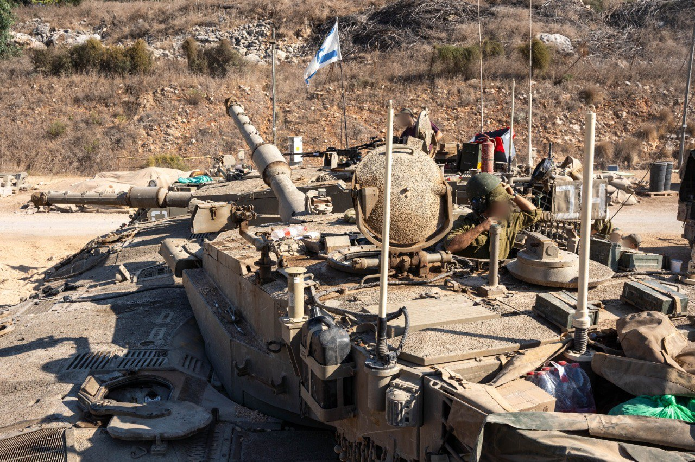

## Message 12282

דובר צה"ל:

אוגדת ׳המפץ׳ (146) החלה אמש (ב׳) בפעילות קרקעית ממוקדת ומתוחמת בדרום לבנון 

אמש (ב׳), כוחות אוגדת ׳המפץ׳ (146) בהן חטיבת ׳כרמלי’ (2) וחטיבת ׳אגרוף הברזל׳ (205) החלו בפעילות קרקעית ממוקדת ומתוחמת בגזרה המערבית של דרום לבנון נגד יעדים ותשתיות טרור של ארגון הטרור חיזבאללה, זאת לאחר כשנה שבה האוגדה ניהלה קרב הגנה בגבול הצפון-מערבי. 

אוגדת ׳המפץ׳ היא אוגדת המילואים הראשונה שמופעלת בלחימה בדרום לבנון במסגרת מבצע ״חיצי הצפון״. מפקדת האוגדה תפקדה במהלך השנה האחרונה כאוגדת הגנה מרחבית וכוחותיה גוייסו למשימות לחימה שונות בצפון, בעזה ובאזור יהודה ושומרון. 

הכוחות פועלים כעת בליווי כוחות ארטילריים של עוצבת ׳התקומה׳ (213) וכוחות נוספים, בכדי לחשוף תשתיות אויב ולהשמידן.

