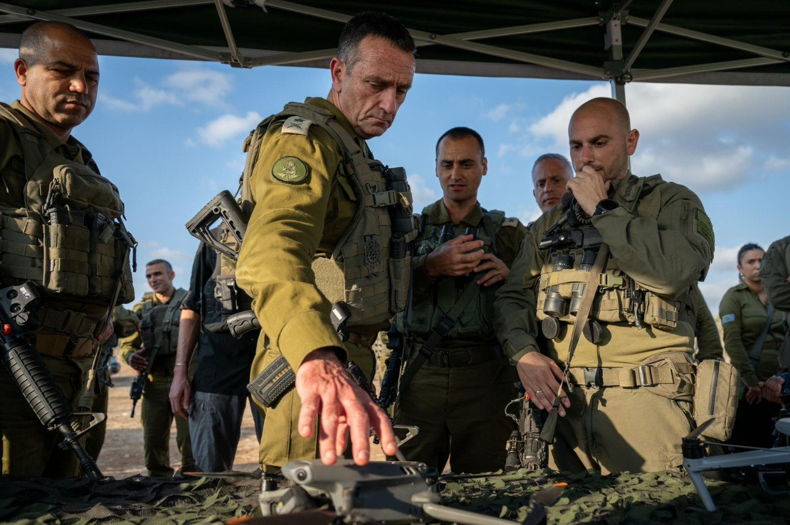

## Message 12299

דובר צה״ל: 

הרמטכ״ל קיים הערכת מצב ביהודה ושומרון 

בהתאם לתמונת המצב המבצעית ונוכח הערכות בצה"ל, הרמטכ"ל, רב-אלוף הרצי הלוי, קיים אתמול (ב') הערכת מצב וסיור ביהודה ושומרון עם מפקד האוגדה, תת-אלוף יקי דולף. 
הרמטכ"ל שוחח עם מפקדי החטיבות בצפון השומרון על הפעילות ההתקפית וההגנתית, בדגש על ההיערכות בימים האחרונים על רקע ההתרעות לתקופת החגים, ופגש את לוחמי ולוחמות גדוד "פנתר" הפועלים בימים אלה במרחב התפר.

