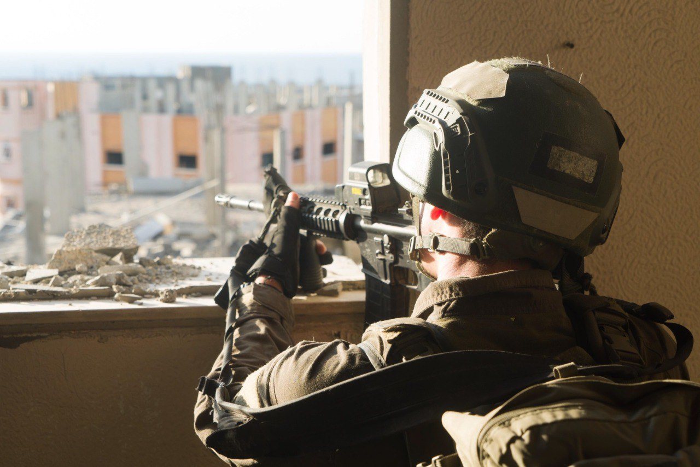

## Message 12306

דובר צה"ל:

כוחות צה"ל ממשיכים להלחם בצפון, מרכז ודרום רצועת עזה: הלוחמים תוקפים יעדי טרור של ארגון הטרור חמאס

במהלך היממה האחרונה כוחות אוגדה 162 חיסלו כ-20 מחבלים מהאוויר ובקרבות פנים אל פנים במרחב ג'באליה.
כוחות צוות הקרב של חטיבה 401 השמידו מחסן אמצעי לחימה, ואיתרו אמצעי לחימה רבים ביניהם רימונים ונשקים מסוג 'קלאצ'ניקוב'.
בסגירת מעגל לוחמים מחטיבה 460 חיסלו מחבלים במבנה ממנו נורה  נ"ט לעבר הכוח ואיתרו אמצעי לחימה נוספים.

במרכז הרצועה, אוגדה 252 פועלת להשמדת תשתיות טרור וחיסול מחבלים באמצעות פשיטות ממוקדות. 
צוות הקרב של חטיבת ׳המחץ׳ (14) יצא ביממה האחרונה למבצע חטיבתי באל בורייג, הכוחות משמידים תשתיות טרור ומחסלים מחבלים.

במסגרת פעילות לוחמי צוות הקרב של חטיבת הנח״ל ובהכוונה מודיעינית, מטוס קרב תקף מבנה ממנו תכננה חוליית מחבלים לפעול נגד כוחותינו וחיסלו אותם. 

לוחמי צוותי הקרב של חטיבות הנח״ל וביסל״ח (828) תחת אוגדת עזה ממשיכים בפעילות במרחב רפיח. 

במהלך היממה האחרונה כלי טיס ומטוסי קרב של חיל האוויר תקפו יותר מ-70 מטרות טרור ברצועת עזה.

