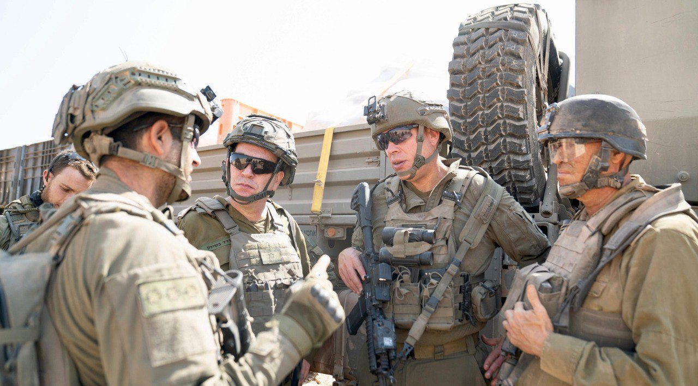

## Message 12311

דובר צה"ל:

ראש אגף המבצעים, אלוף עודד בסיוק, מפקד אוגדה 36, תת-אלוף מורן עומר ומפקד חטיבת גולני, אלוף-משנה עדי גנון קיימו אתמול (ב'), סיור שטח בדרום לבנון. אנשי האוגדה סקרו לאלוף על העבודה שנעשתה בשטח והלחימה באזור והתכניות להמשך.

