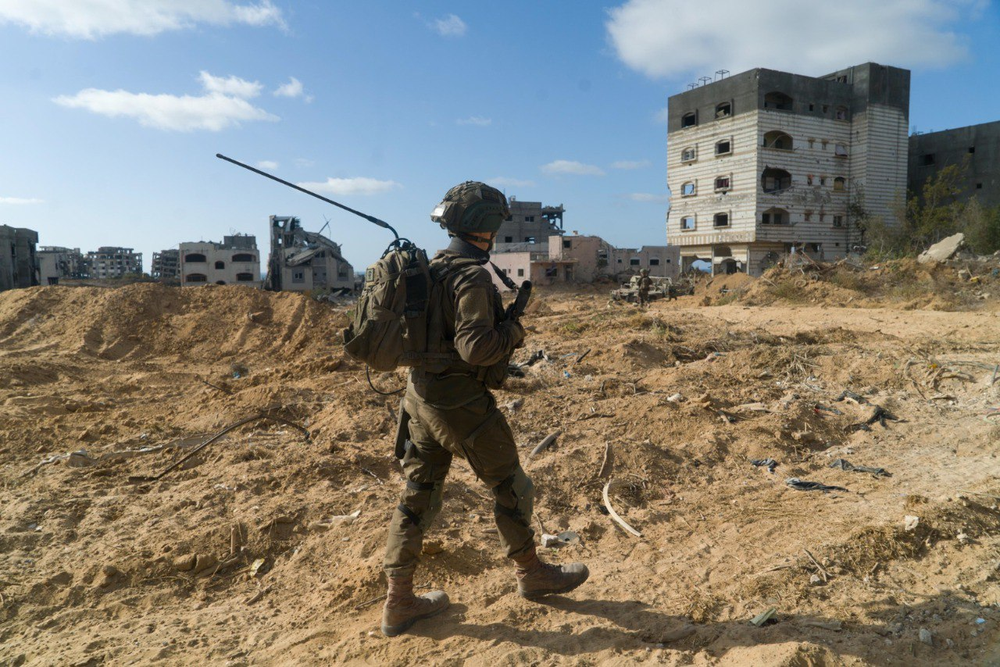

## Message 12363

דובר צה"ל:

כוחות צה״ל ממשיכים לפעול בדרום לבנון וברצועות עזה: חיל האוויר תקף יותר מ-230 מטרות טרור במהלך היממה האחרונה

כוחות צה"ל ממשיכים לפעול בדרום לבנון, הכוחות חיסלו מחבלים בהתקלויות פנים אל פנים ומהאוויר, איתרו ונטרלו עמדות שיגור להסרת איום מישובי הצפון, אמצעי לחימה מסוגים שונים בהם טילי נ״ט רבים. 

במקביל, לוחמי צה"ל ממשיכים לפעול ברצועת עזה בהובלת אוגדת 162, 252 ואוגדת עזה, הכוחות חיסלו מחבלים בקרבות קרקע ומהאוויר, איתרו אמצעי לחימה בהם רימונים, נשקים מסוג "קלאצ׳ניקוב" ועוד, השמידו תשתיות טרור  ומשגרי רקטות אשר היו טעונים ומוכנים לשיגור לעבר מדינת ישראל.

במהלך היממה האחרונה חיל האוויר תקף כ-185 מטרות צבאיות של ארגון הטרור חיזבאללה בלבנון וכ-45 מטרות של ארגון הטרור חמאס ברצועת עזה, בהן חוליות פעילים, תשתיות צבאיות, מבנים צבאיים, עמדות תצפית, משגרים ומחסני של אמצעי לחימה של ארגוני הטרור.

כוחות צה"ל ערוכים, בהגנה ובהתקפה, לכל הגזרות.

