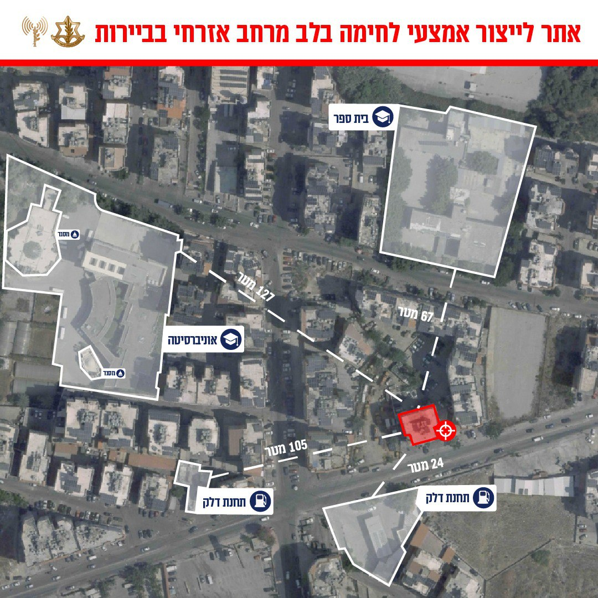

## Message 12375

דובר צה"ל: 

צה"ל תקף מחסני כטב"מים ומשגרים מוכנים לשיגור בדרום לבנון בנוסף הותקפו מטרות טרור של חיזבאללה אשר מוקמו בסמוך למתקנים אזרחיים במרחב הדאחייה בביירות 

במהלך הלילה, מטוסי קרב של חיל האוויר, בהכוונה מודיעינית מדויקת של אגף המודיעין, ביצעו תקיפות ממוקדות במרחב הדאחייה בביירות של אתר לייצור אמצעי לחימה של ארגון הטרור חיזבאללה ומפקדה של מטה המודיעין של הארגון.

טרם התקיפה ננקטו צעדים רבים כדי לצמצם את הסיכוי בפגיעה בבלתי מעורבים הכוללים אזהרות מקדימות לאוכלוסייה באזור.

ארגון הטרור חיזבאללה ממקם את אתרי הייצור ואמצעי הלחימה שלו מתחת לבנייני מגורים, בתי ספר, מסגדים ואוניברסיטאות בלב העיר ביירות המסכן את האוכלוסייה באזור.

אתמול (ג'), מטוסי קרב של חיל האוויר בהכוונת מודיעינית מדוייקת תקפו ברחבי דרום לבנון מחסני כלי טיס בלתי מאוישים שהיו מעל ומתחת לקרקע, בנוסף למשגרים שהיו מוכנים לשיגור השייכים ליחידה האווירית של הארגון.

