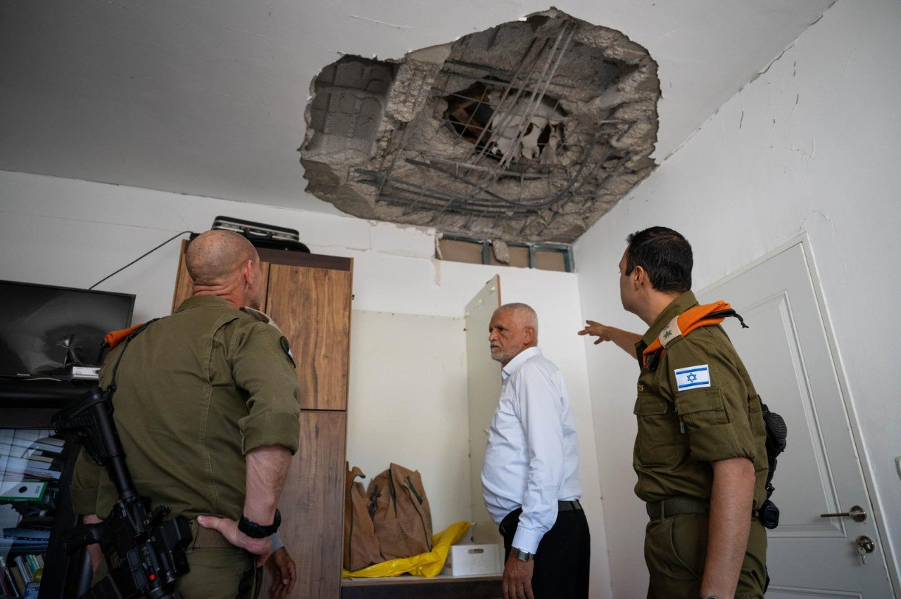

## Message 12400

דובר צה"ל:

מפקד פיקוד העורף בביקור רשויות בצפון: ככל שהעורף יידע להיות יציב, חזק ועם מינימום נפגעים - זה מאוד מהותי ומייצר לחץ גדול על חיזבאללה

מפקד פיקוד העורף, אלוף רפי מילוא, ביקר אתמול (ד׳) בערים ורשויות מקומיות בצפון, ביניהן דיר אל אסד, כרמיאל וטבריה. 

במסגרת הביקור, נפגש האלוף עם ראשי הרשויות ונציגיהם, ושם דגש על שיתוף הפעולה ההדוק בין פיקוד העורף למרחב האזרחי. 

במהלך המפגשים, דנו בתמונת המצב העדכנית וההיערכות להמשך, במטרה לחזק את רמת המוכנות של התושבים להתמודדות עם מצבי חירום שונים, תוך התמקדות באתגרים הנובעים מהתפתחות המערכה בגזרה הצפונית.

