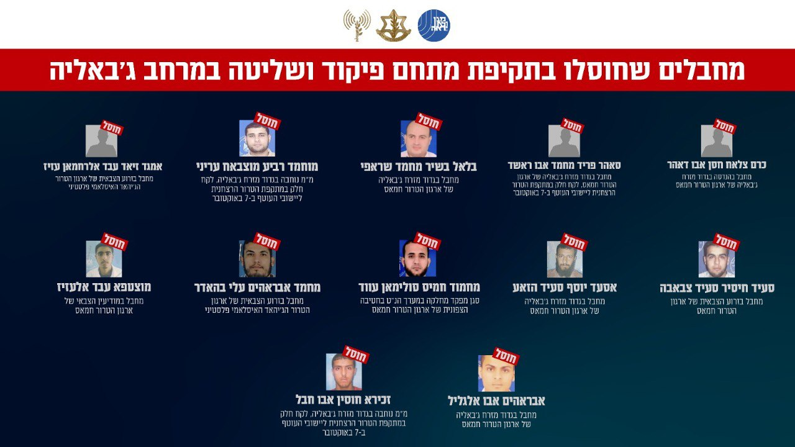

## Message 12442

הודעה משותפת לדובר צה״ל ודוברות שב״כ:

בתקיפת מתחם פיקוד ושליטה בג'באליה: צה"ל ושב"כ חיסלו לפחות 12 מחבלים, חלקם לקחו חלק במתקפת הטרור הרצחנית ליישובי העוטף ב-7 באוקטובר

כלי טיס של חיל האוויר תקפו אתמול (ד'), בהכוונה מודיעינית מדויקת של אמ"ן, שב"כ וחטיבת האש 215 בפיקוד אוגדה 162, מחבלים שפעלו במתחם פיקוד ושליטה במרחב ששימש בעבר כמתחם רפואי בג'באליה. 

מתחם הפיקוד והשליטה שימש את המחבלים לתכנון והוצאת מתווי טרור נגד אזרחי מדינת ישראל וכוחות צה״ל, ובו אמצעי לחימה רבים.

בשלב זה, ניתן לאשר כי בתקיפה חוסלו לפחות 12 מחבלים מארגוני הטרור חמאס וגא"פ, בהם:

