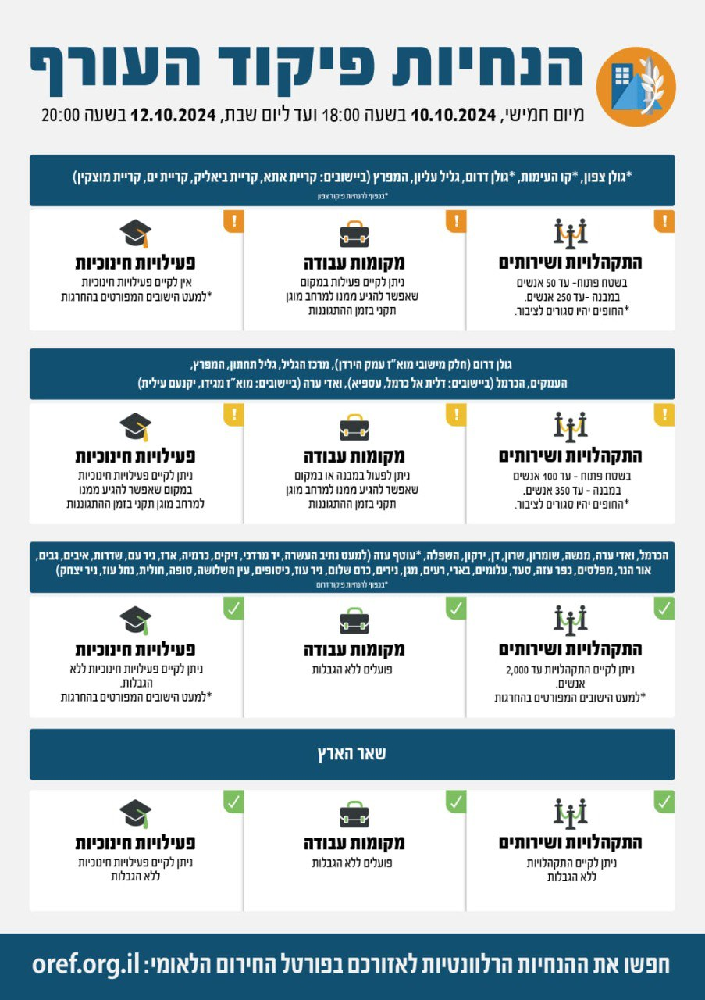

## Message 12444

דובר צה״ל:

שינויים במדיניות ההתגוננות של פיקוד העורף

בתום הערכת מצב, הוחלט כי היום (ה') בשעה 18:45, יתעדכנו הנחיות ההתגוננות של פיקוד העורף. במסגרת השינויים אזור הנחייה מרכז הגליל יעבור ממדרג פעילות מצומצמת למדרג פעילות חלקית, המאפשר קיום פעילויות חינוכיות במקום שאפשר להגיע ממנו למרחב מוגן תקני בזמן ההתגוננות. כמו כן באזור הנחייה גליל עליון ניתן יהיה לקיים פעילות חינוכית בתוך מרחב מוגן תקני (שאר ההנחיות באזור זה ללא שינוי).

כמו כן, הוחלט כי ביישובים הנמצאים במדרג פעילות חלקית, באזורי הנחייה גולן דרום (בחלק מיישובי מוא"ז עמק הירדן), מרכז הגליל, גליל תחתון, המפרץ, העמקים, הכרמל (ביישובים דלית אל כרמל ועספיא) וואדי ערה (ביישובים מוא"ז מגידו ויקנעם עלית) ניתן יהיה לקיים התקהלויות ושירותים של עד 100 אנשים בשטח פתוח (במקום 60 אנשים עד כה) ועד 350 אנשים במבנה (במקום 300 עד כה).

שאר אזורי הארץ נותרו ללא שינוי בהנחיות שניתנו עד כה.

יש להמשיך ולעקוב אחר ההנחיות המפורסמות על ידי פיקוד העורף באמצעי ההפצה הרשמיים. ההנחיות המלאות מעודכנות בפורטל החירום הלאומי וביישומון פיקוד העורף.

