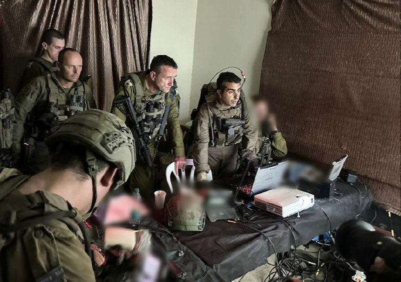

## Message 12447

דובר צה״ל:

הרמטכ״ל ור׳ השב״כ בהערכת מצב בדרום לבנון

הרמטכ״ל, רב-אלוף הרצי הלוי וראש שירות הביטחון הכללי, רונן בר קיימו היום (ה׳) הערכת מצב משותפת עם הכוחות הלוחמים בדרום לבנון עם מפקד פיקוד הצפון ומפקד אוגדה 91.

