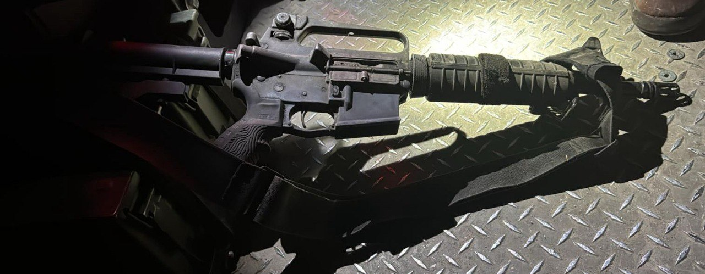

## Message 12454

הודעה משותפת לדובר צה"ל ודוברות שב"כ:

 צה"ל ושב"כ חיסלו את ראש התארגנות הטרור של הגא״פ בנור א-שמס ומחבל נוסף בתקיפה מהאוויר 

בפעילות משותפת של צה"ל ושב"כ אמש (ה'), במהלך פעילות עם לוחמי חטיבת כפיר, כלי טיס תקף במרחב טולכרם וחיסל את מחמד עבדאללה, ראש התארגנות הטרור של הגא״פ בנור א-שמס שבטול כרם, יחד עימו חוסל מחבל נוסף.

עבדאללה היה מחליפו של מחמד ג׳אבר (אבו שוג׳עא), ראש התארגנות הטרור בטולכרם שחוסל ע״י כוח ימ״מ ב-29.8. 

בחודשים האחרונים היה אחראי על התארגנות הטרור במחנה והיה מעורב בביצוע פיגועים רבים. כמו כן, פעל בתחום הפעלת מטענים לעבר כוחות צה״ל שפעלו בגזרת טולכרם.

על המחבלים אותרו רובים מסוג M-16 ווסטים שהוחרמו על ידי לוחמי צה״ל יחד עם הרכב בו השתמשו המחבלים.

