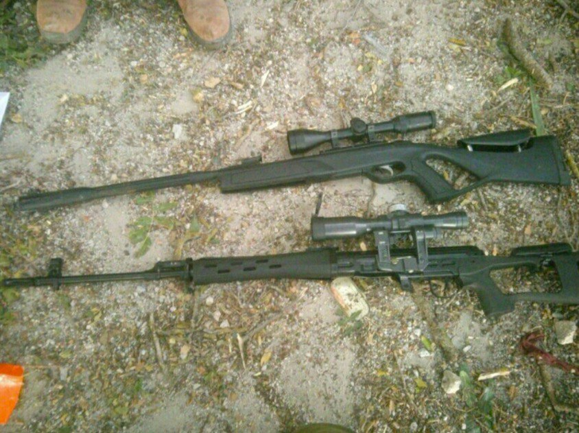

## Message 12494

דובר צה״ל:

עשרות מחבלים חוסלו מהאוויר ומהקרקע, חיל האוויר תקף כ-280 מטרות טרור: פעילות כוחות צה"ל בסוף השבוע בעזה ובלבנון

כוחות צה"ל פעלו ביממה האחרונה בעוצמה ובאופן ממוקד כנגד תשתיות טרור ומחבלי חיזבאללה בדרום לבנון. 
הכוחות חיסלו 50 מחבלים בהיתקלויות פנים אל פנים ובהכוונת תקיפות של חיל האוויר, והשמידו מהאוויר ובארטילריה יותר מ-200 מטרות טרור של חיזבאללה.

הלוחמים איתרו במהלך הלחימה במרחב פירי מנהרות תת-קרקעיות, עשרות תשתיות בהן אוחסנו אמצעי לחימה, משגרי רקטות, פצצות מרגמה ונ"ט שכוונו לעבר יישובי הצפון והכוחות שפועלים במרחב. 
בנוסף, איתרו הכוחות ציוד לחימה, נשקים ותחמושת של מחבלי חיזבאללה.

חיל האוויר תקף בעומק ובדרום לבנון, והשמיד עשרות משגרי רקטות וטילי קרקע-קרקע, ממרביתם בוצעו שיגורים בסוף השבוע לעבר שטח הארץ.
בנוסף, חיל האוויר תקף תשתית תת-קרקע בה אוחסנו אמצעי לחימה של ארגון הטרור חיזבאללה בגבול סוריה-לבנון.

במקביל, לוחמי צה"ל פעלו ברחבי רצועת עזה, השמידו תשתיות טרור וחיסלו עשרות מחבלים.

