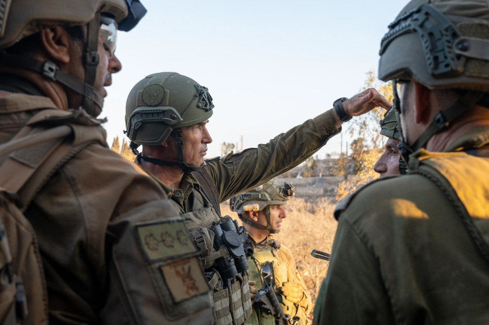

## Message 12517

דובר צה״ל:

מפקד פיקוד הצפון וראש אגף המודיעין קיימו הערכת מצב עם כוחות עוצבת "הגליל" (91) בדרום לבנון 

מפקד פיקוד הצפון, אלוף אורי גורדין וראש אגף המודיעין, אלוף שלומי בינדר קיימו אתמול (ש׳) הערכת מצב בדרום לבנון יחד עם מפקד עוצבת "הגליל" (91), תת-אלוף שי קלפר, מפקד חטיבת "הזקן" (8), אלוף-משנה דורי סער ומפקדים נוספים.

במהלך הערכת המצב המפקדים הדגישו את פעילות צה״ל בהתקפה ליצירת הביטחון להחזרת תושבי הצפון לבתיהם. המפקדים אישרו תוכניות להמשך ותדרכו את הכוחות להמשך הלחימה.

הכוחות בשטח הציגו את אמצעי הלחימה שאותרו בתשתית תת-קרקעית של ארגון הטרור חיזבאללה במרחב. כמו כן, המפקדים ציינו את החשיבות בהנגשת המודיעין ישירות אל הלוחם בקצה, וכן את הצורך בהמשך פעילות התקפית כנגד ארגון הטרור חיזבאללה.

