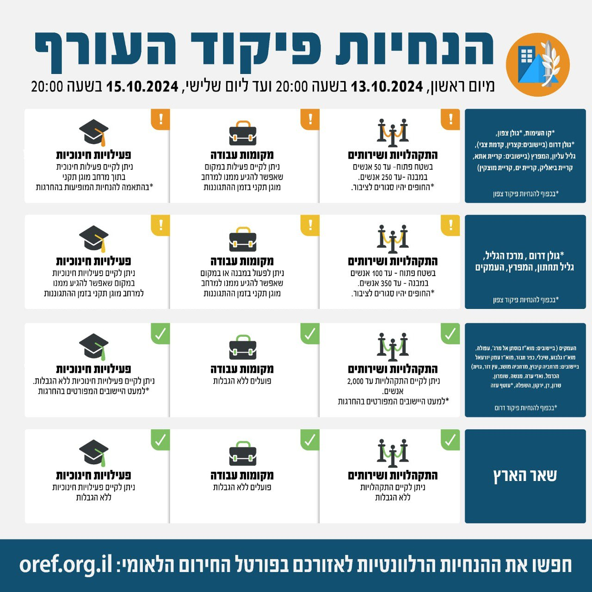

## Message 12534

דובר צה״ל:

שינויים במדיניות ההתגוננות של פיקוד העורף

בתום הערכת מצב, הוחלט כי היום (א׳) בשעה 20:00, יתעדכנו הנחיות ההתגוננות של פיקוד העורף. במסגרת השינויים אזור הנחייה גולן דרום (למעט ביישובים קצרין וקדמת צבי) יעבור ממדרג פעילות מצומצמת למדרג פעילות חלקית. כמו כן אזור הנחייה העמקים (ביישובים: מוא"ז בוסתן אל מרג', עפולה, מוא"ז גלבוע, שיבלי, כפר תבור וחלק מיישובי מוא"ז עמק יזרעאל- בישובים מרחביה קיבוץ, מרחביה מושב, עין דור וגזית) והיישובים מוא"ז מגידו ויקנעם עלית באזור הנחייה ואדי ערה יעברו ממדרג פעילות חלקית למדרג פעילות מלאה עם הגבלת התקהלויות ושירותים של עד 2,000 אנשים. 
שאר אזורי הארץ נותרו ללא שינוי בהנחיות שניתנו עד כה.

יש להמשיך ולעקוב אחר ההנחיות המפורסמות על ידי פיקוד העורף באמצעי ההפצה הרשמיים.
ההנחיות המלאות מעודכנות בפורטל החירום הלאומי וביישומון פיקוד העורף.

