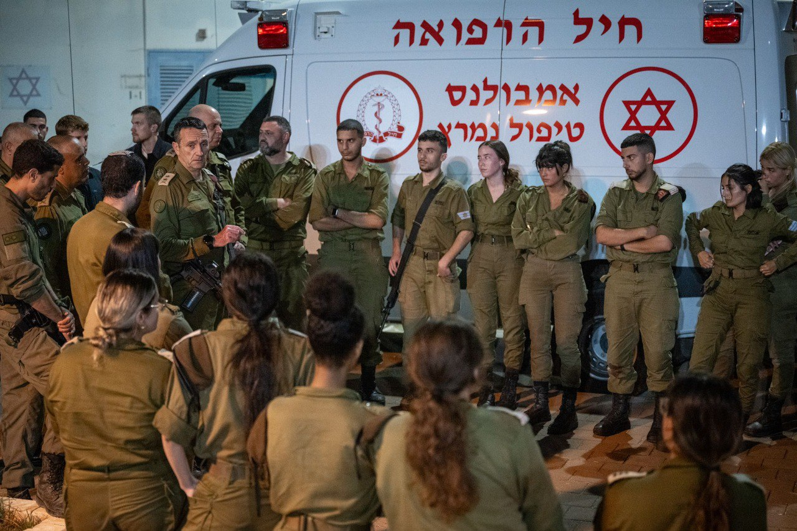

## Message 12542

דובר צה״ל: 

הרמטכ״ל בבא״ח גולני: ״חטיבת גולני רשמה הישגים רבים במלחמה והתמודדה בנחישות עם מצבים קשים״

הרמטכ״ל, רב-אלוף הרצי הלוי, הגיע אמש לבסיס האימונים של חטיבת גולני וקיים תחקיר ראשוני עם המפקדים.
הרמטכ״ל שוחח עם המפקדים וצוותי הרפואה בבסיס. 

מדברי הרמטכ״ל: ״אנחנו במלחמה, ותקיפה של בבסיס אימונים בעורף היא קשה והתוצאות כואבות. פעלתם היטב בטיפול ופינוי הפצועים והנפגעים. חבקו את המשפחות השכולות, לוו את הפצועים וחזקו את המפקדים והחיילים. 

אנחנו ממשיכים להילחם ולהתאמן לקראת הבאות. חטיבת גולני רשמה הישגים רבים במלחמה והתמודדה בנחישות עם מצבים קשים, לכו בדרך המורשת״.

