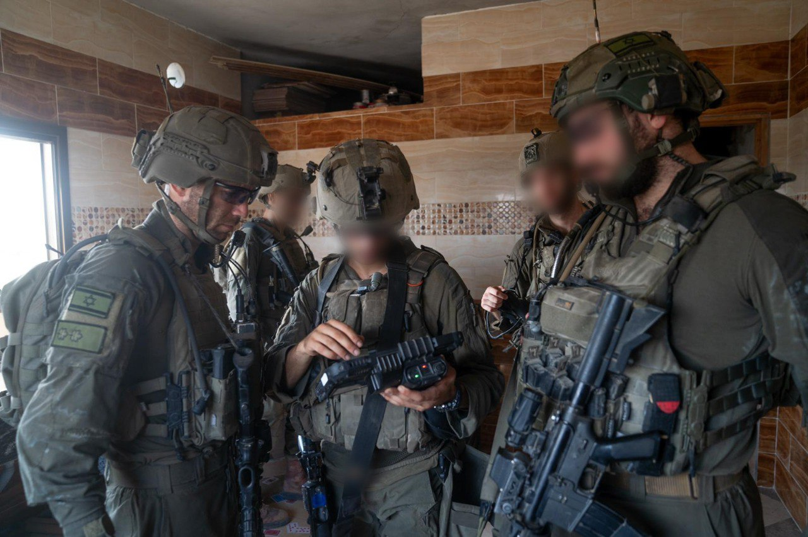

## Message 12547

דובר צה"ל:

כוחות צה״ל ממשיכים בפעילותם בדרום לבנון וברצועת עזה, ביממה האחרונה עשרות מחבלים חוסלו וחיל האוויר השמיד כ-220 תשתיות טרור

במסגרת הפעולה הקרקעית כנגד ארגון הטרור חיזבאללה בדרום לבנון, כוחות צה״ל חיסלו עשרות מחבלים בקרבות פנים אל פנים ובתקיפות מהאוויר.
חיל האוויר השמיד כ-200 מטרות טרור, בהן משגרים, עמדות שיגור נ"ט, מבנים צבאיים, מטרות טרור נוספות ומחסני אמצעי לחימה בהם משגרים, טילי נ״ט, משגרי RPG, תחמושת ועוד.

כוחות אוגדה 162, אוגדת עזה ואוגדה 252 ממשיכים לפעול ברחבי רצועת עזה וחיסלו ביממה האחרונה מחבלים בהיתקלויות פנים מול פנים ובתקיפות אוויריות. הכוחות ממשיכים להשמיד תשתיות טרור, לאתר אמצעי לחימה, לאתר פירים ולנטרלם.

