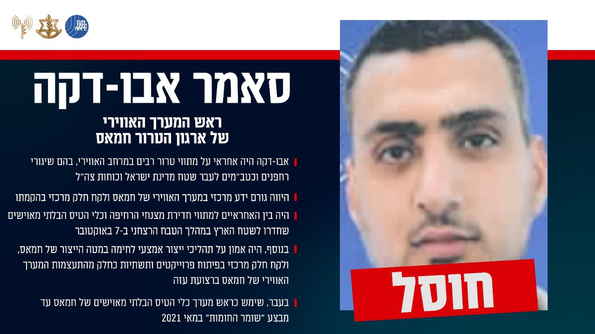

## Message 12572

הודעה משותפת לדובר צה״ל ודוברות שב״כ:

צה"ל ושב"כ חיסלו את ראש המערך האווירי של ארגון הטרור חמאס: היה בין האחראיים למתווי חדירת מצנחי הרחיפה והכטב״מים ב-7 באוקטובר לשטח הארץ

מטוסי קרב של חיל האוויר, בהכוונה של אמ"ן, שב"כ וחיל האוויר, תקפו במהלך חודש ספטמבר 2024 וחיסלו את המחבל סאמר אבו-דקה, ראש המערך האווירי של ארגון הטרור חמאס, שהחליף את ראש המערך האווירי הקודם שחוסל בחודש אוקטובר 2023. 

אבו-דקה היה אחראי על מתווי טרור רבים במרחב האווירי, בהם שיגורי רחפנים וכטב״מים לעבר שטח מדינת ישראל וכוחות צה"ל, היווה גורם ידע מרכזי במערך האווירי של חמאס ולקח חלק מרכזי בהקמתו. 
היה בין האחראיים למתווי חדירת מצנחי הרחיפה וכלי הטיס הבלתי מאוישים שחדרו לשטח הארץ במהלך הטבח הרצחני ב-7 באוקטובר.

בעבר, שימש כראש מערך כלי הטיס הבלתי מאוישים של חמאס עד מבצע ״שומר החומות״ במאי 2021.
בנוסף, היה אמון על תהליכי ייצור אמצעי לחימה במטה הייצור של חמאס, ולקח חלק מרכזי בפיתוח פרוייקטים ותשתיות כחלק מהתעצמות המערך האווירי של חמאס ברצועת עזה.

