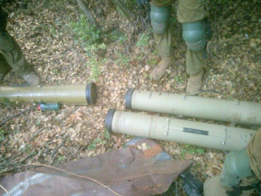

## Message 12574

דובר צה"ל:

צה"ל תקף ביממה האחרונה כ-230 מטרות טרור ברצועת עזה ובלבנון: הותקפו בלבנון משגרי טילי קרקע-קרקע

כוחות צה"ל ממשיכים לפעול באופן ממוקד נגד תשתיות טרור ומחבלי חיזבאללה בדרום לבנון. 
הכוחות חיסלו עשרות מחבלים בהיתקלויות פנים אל פנים ובהכוונת תקיפות של חיל האוויר, השמידו תשתיות טרור של חיזבאללה ואיתרו אמצעי לחימה רבים.
באחת התקיפות, הכוחות זיהו מספר מחבלים נכנסים למבנה צבאי במרחב, זמן קצר לאחר מכן, כלי טיס של חיל האוויר תקף את המבנה הצבאי וחיסל את המחבלים.

חיל האוויר, בשיתוף פיקוד הצפון תקף ביממה האחרונה כ-200 מטרות טרור של חיזבאללה בעומק ובדרום לבנון. בין המטרות שהותקפו: חוליות מחבלים, עמדות נ"ט ומשגרי טילי קרקע-קרקע.

ברצועת עזה, כוחות אוגדה 162 ממשיכים לפעול במרחב ג׳באליה שם חוסלו ביממה האחרונה מחבלים, בהם חוליית מחבלים שביצעה ירי נ"ט לעבר הכוחות. בנוסף, הכוחות זיהו מספר מחבלים חמושים שהיוו איום על הכוחות, לאחר הזיהוי, הכווינו כלי טיס של חיל האוויר שחיסל את המחבלים.

