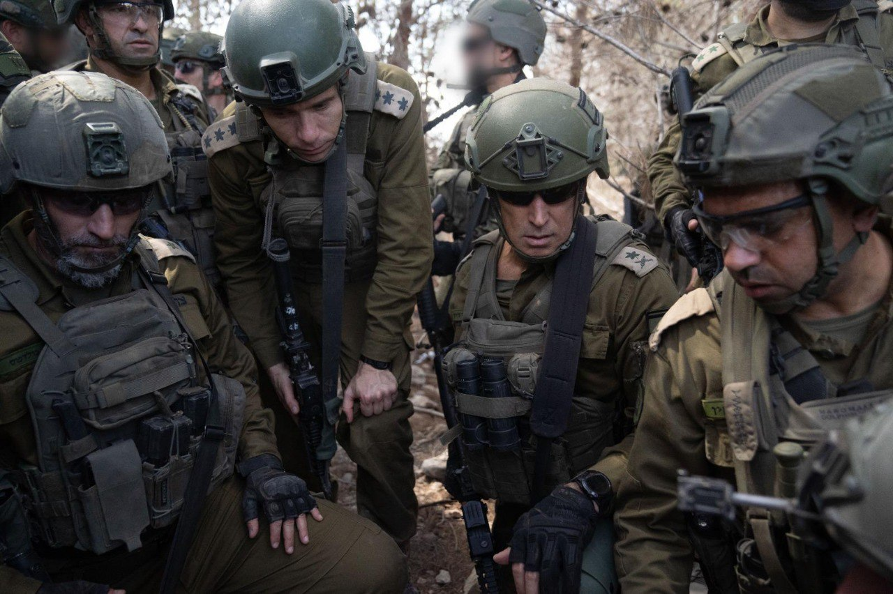

## Message 12606

דובר צה״ל: 

מפקד פיקוד הצפון ללוחמי אוגדה 146 בלבנון: "אנחנו נחושים להגיע לפה, להשמיד את כל התשתיות ולהרחיק את חיזבאללה"

מפקד פיקוד הצפון, אלוף אורי גורדין, קיים בסוף השבוע האחרון הערכת מצב וסיור בשטח לבנון עם מפקד הגיס הצפוני ומערך התמרון, אלוף דן גולדפוס, מפקד עוצבת 'המפץ' (146), תת-אלוף יפתח נורקין, מפקדי ולוחמי האוגדה בעת פעילותם הקרקעית בדרום לבנון. 

המפקדים ציינו את חשיבות פעילות כוחות המילואים לצד הכוחות הסדירים במרחב, אשר מהווים נדבך הכרחי לשינוי המציאות הביטחונית ולהחזרת תושבי הצפון לבתיהם. 

מדבריו של מפקד פיקוד הצפון, אלוף אורי גורדין: "מאחורינו פיר של חיזבאללה מתוך תשתית שלמה של כוח רדואן שתיכנן מפה לצאת להתקפה. אנחנו נחושים להגיע ולהשמיד את כל התשתיות ולהרחיק מפה את חיזבאללה, הוא לא יוכל לצאת מפה להתקפה".

