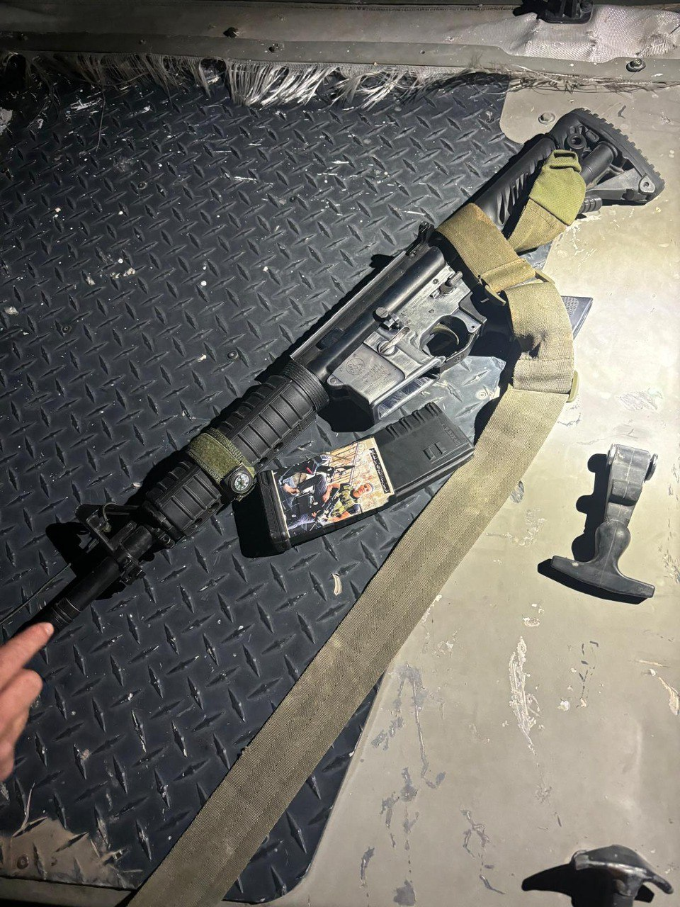

## Message 12620

הודעה משותפת לדוברות המשטרה, דובר צה"ל ודוברות שב"כ:

כוחות הביטחון סיכלו במקביל שני ניסיונות פיגוע בחטיבת מנשה: מסתערבי מג״ב איו״ש חיסלו בג׳נין מחבל שתכנן לבצע פיגוע בטווח זמן המיידי, כוח צה״ל תפס מחבל חמוש בנשקים במרחב התפר

לפני זמן קצר תצפיתניות מיחידה 636 זיהו חשוד סמוך לגדר במרחב התפר, מחוץ ליישוב ריחן. כוח מגדוד המילואים 7014 שקפץ לנקודה עצר את המחבל שהיה חמוש באקדח ורובה מסוג "M-16". 
המחבל הועבר להמשך חקירת כוחות הביטחון.

במקביל, מסתערבי מג״ב איו״ש פעלו בהכוונת שב״כ במרחב ג׳נין למעצר מבוקש אשר תכנן לבצע פיגוע בטווח הזמן המיידי.
הכוחות ניהלו חילופי אש עם המבוקש שהתבצר במבנה וחיסלו אותו, אין נפגעים לכוחותינו.

