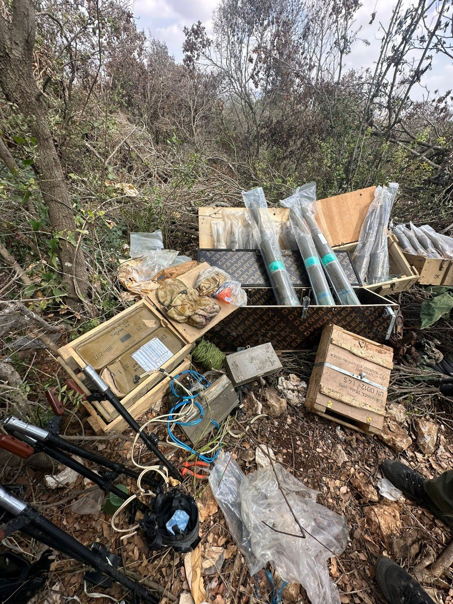

## Message 12625

דובר צה״ל:

אוגדה 98 ממשיכה בפעילותה בדרום לבנון, בפעילות צה"ל בדרום לבנון חוסלו ביממה האחרונה עשרות מחבלים ואמצעי לחימה רבים הושמדו; ברצועת עזה חוסל מפקד מערך כלי הטיס הבלתי מאוישים של ארגון הטרור חמאס בצפון הרצועה

כוחות אוגדה 98 ממשיכים בפעילותם בדרום לבנון. הלוחמים חיסלו מחבלים רבים על הקרקע ומהאויר, וממשיכים לאתר ולהשמיד אמצעי לחימה ותשתיות טרור של חיזבאללה מעל ומתחת לקרקע.

לוחמי צה"ל חיסלו ביממה האחרונה עשרות מחבלים בדרום לבנון בחילופי אש עם המחבלים ובתקיפות של חיל האוויר. הלוחמים איתרו אמצעי לחימה רבים במהלך הפעילויות במרחב, בהם משגרי רקטות, פצצות מגרמה וטילי נ"ט שכוונו ליישובי הצפון, נשקים, רימונים וציוד צבאי נוסף.

בהכוונת פיקוד הצפון, הותקפו מהאוויר יותר מ-140 מטרות טרור של ארגון הטרור חיזבאללה ביותר מ-50 מרחבים בלבנון, בהן מחסני אמצעי לחימה, משגרים שכוונו לעבר שטח מדינת ישראל, מבנים צבאיים וחוליות מחבלים. באחת הפעילויות, כוחות אוגדה 91 זיהו מחבלים שירו לעברם, והכווינו כלי טיס של חיל האוויר שתקף את המחבלים וחיסל אותם.

