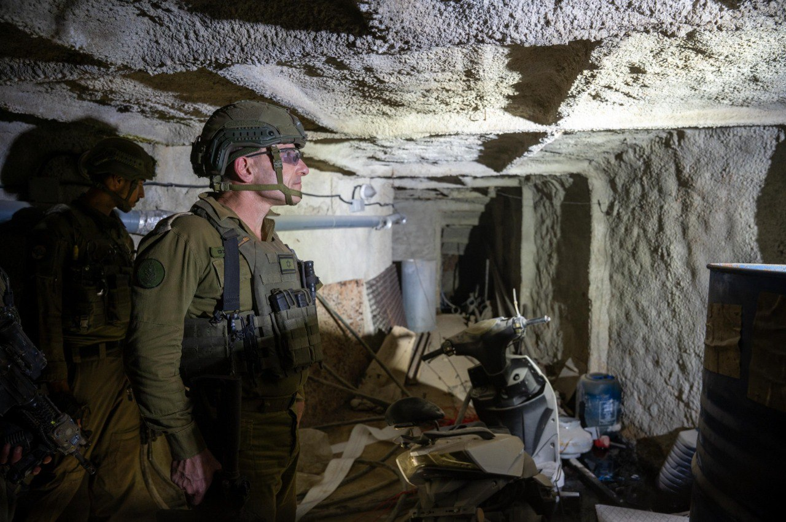

## Message 12637

דובר צה"ל:

סגן הרמטכ״ל ללוחמי יהל״ם וחטיבה 8 בדרום לבנון: אנו משמידים את התשתיות של חיזבאללה, וכך צריך להמשיך ולעשות, אין דרך אחרת

סגן הרמטכ״ל, אלוף אמיר ברעם, קיים אתמול (ג׳) הערכת מצב עם מפקד עוצבת ״הגליל״ (91), תת-אלוף שי קלפר, מפקד חטיבת ״הזקן״ (8), אלוף-משנה דורי סער ומפקד יחידת יהל״ם, אלוף-משנה א׳, ושוחח עם לוחמים בעת פעילותם הקרקעית בדרום לבנון. 

סגן הרמטכ״ל ביקר במתחם התת-קרקעי  ששימש כמפקדה של ״כוח רדואן״, שאותר לאחרונה על ידי לוחמי החטיבה בשיתוף לוחמי יחידת יהל״ם שפשטו על המרחב.

מדברי סגן הרמטכ״ל, אלוף אמיר ברעם: "שנים שאוגדה 91 ופיקוד הצפון התכוננו להגנה ובלימה מפני מה שחיזבאללה כינה 'כיבוש הגליל'. זה מעורר עוצמה וגאווה שכעת אנחנו נלחמים בשטח ממנו הם תכננו לפגוע בנו - משמידים את התשתיות והתכניות שלהם. כך צריך לעשות, אין דרך אחרת. תמשיכו בעשייה מבצעית איכותית ומשמעותית שעתידה להשפיע עלינו שנים קדימה ועל המזרח התיכון".

