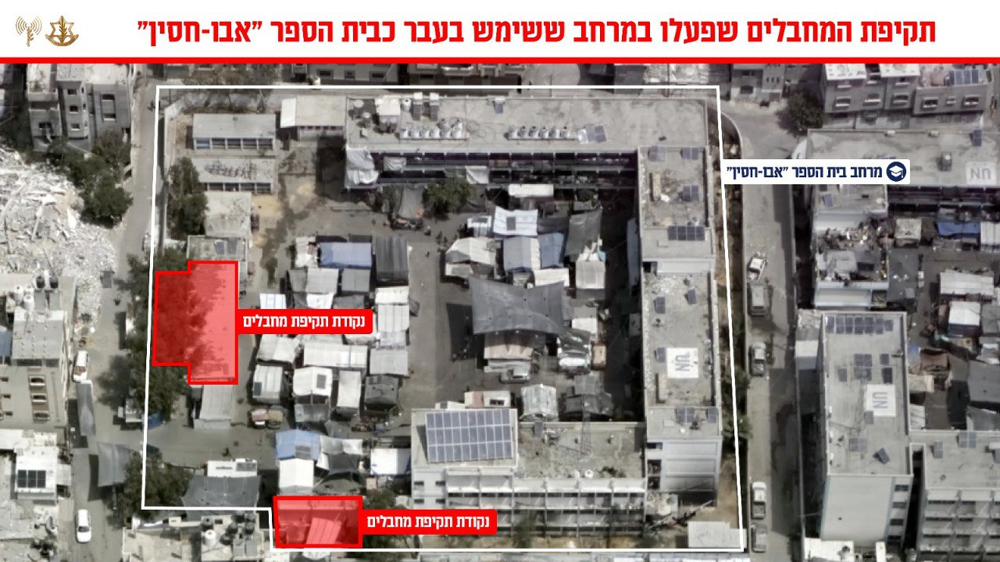

## Message 12661

דובר צה"ל:

כלי טיס של חיל האוויר תקף לפני זמן קצר, באופן ממוקד ומדויק ובהכוונה מודיעינית של אמ״ן, שב״כ ופיקוד הדרום, נקודות ריכוז של מחבלים רבים מארגוני הטרור חמאס וגא״פ שפעלו במתחם פיקוד ושליטה שהוקם ברחבה ששימשה בעבר כרחבת בית הספר ״אבו חסן״ בצפון רצועת עזה.

ברחבת בית הספר בשעת התקיפה שהו עשרות מחבלים מארגוני הטרור חמאס וגא"פ, בינהם:
* חוסאם מוחמד עטיה צלאח
* אחמד עבד אלנאצר עווד חמדונה
* אכרם מאהר נמר זקול
* אחמד עבד אלרחמן מחמוד אבו אלגבין
* מצטפא עלי חליל עודה
* מחמד עבדאללה עבד אלרחמאן תמראז
* מחמד מחמד ראפת חסין דאהר
* מחמוד מוסה עבד אלוהאב עטל
* עבד אלכרים חסן עוד חמדונה
* יוסף חוסני עלי סאלם
* מחמד סמיח עטוה שיר
* עבד אלרחמאן פוזי כאמל ושח

מחבלים אלו מעורבים במתווי ירי תמ״ס לשטח הארץ, ופועלים להוצאת מתווי טרור נגד כוחות צה״ל ומדינת ישראל במהלך התקופה האחרונה והימים האחרונים בפרט.

