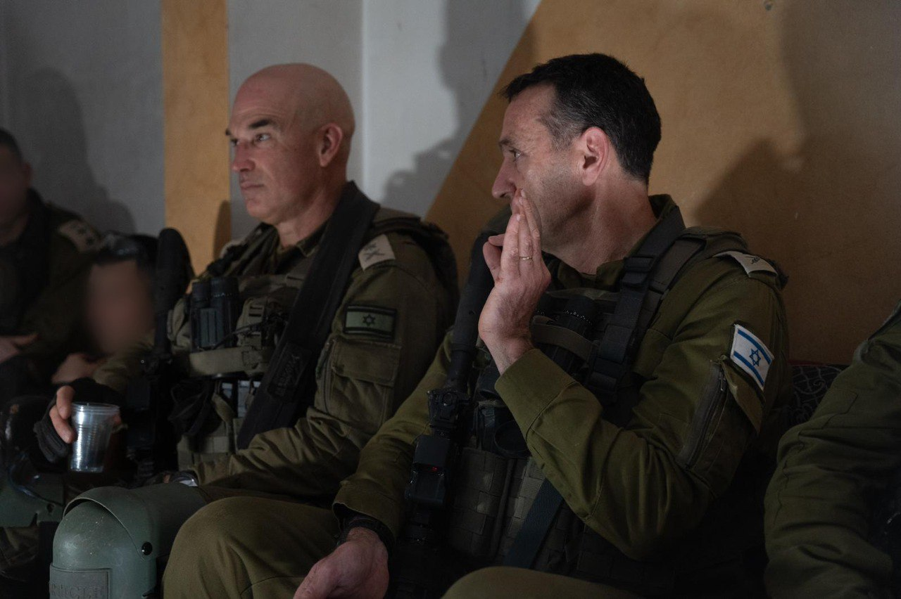

## Message 12713

דובר צה״ל: 

הרמטכ״ל למפקדי גולני בדרום לבנון: ״מעריכים כ-1,500 פעילי חיזבאללה הרוגים, זה והעובדה שהם נכנעים, הם הישגים חשובים״

הרמטכ״ל, רב-אלוף הרצי הלוי קיים השבוע  סיור שטח עם לוחמי חטיבת גולני וחטיבה 188 הפועלים בדרום לבנון, וקיים הערכת מצב עם מפקד פיקוד הצפון, מפקד הגיס הצפוני, מפקד אוגדה 36 ומפקדים נוספים.

