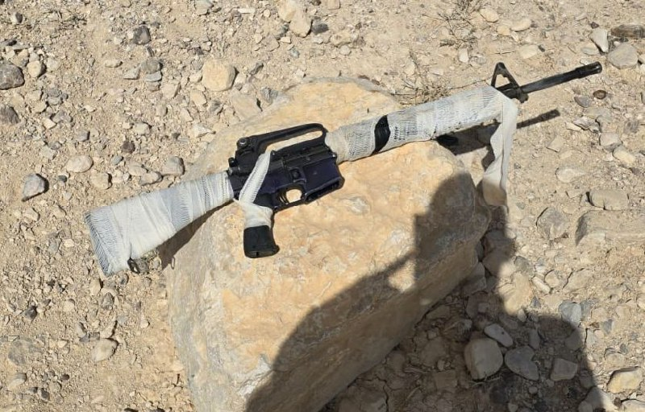

## Message 12800

דובר צה״ל:

כוחות צה"ל עצרו ארבעה חשודים חמושים בנשק מסוג 'M16' ומחסנית במרחב נבי מוסא בחטיבת הבקעה והעמקים, זמן קצר לאחר שהתקבלו דיווחים על התנהגות מחשידה.

המחבלים ואמצעי הלחימה שאותרו הועברו לטיפול כוחות הביטחון. אין נפגעים.

