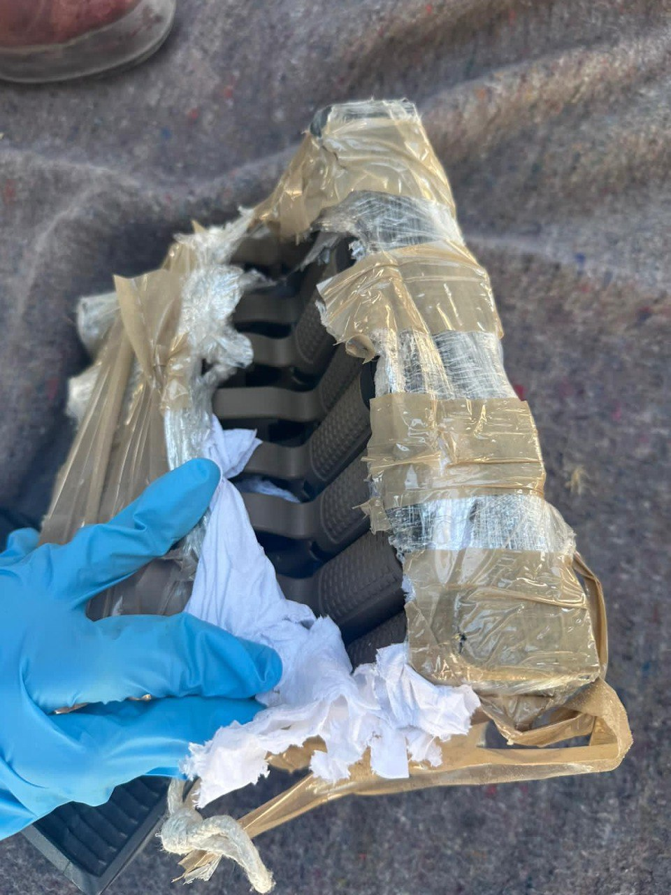

## Message 12802

דובר צה"ל:

סוכלה הברחת אמצעי לחימה במרחב גבול מצרים

תצפיתניות צה"ל מחטמ"ר פארן זיהו אתמול (ש') רחפן שהיה במעקב צה"ל וחצה משטח מצרים לשטח ישראל במרחב חטיבת פארן. 
כוח צה"ל מגדוד קרקל הוקפץ לנקודה, ירה לעבר הרחפן, הפיל אותו, ואיתר בו שמונה אקדחים ומחסניות. הרחפן היה במעקב הכוחות עד להפלתו.

מצורפות תמונות של אמצעי הלחימה שאותרו על הרחפן:

