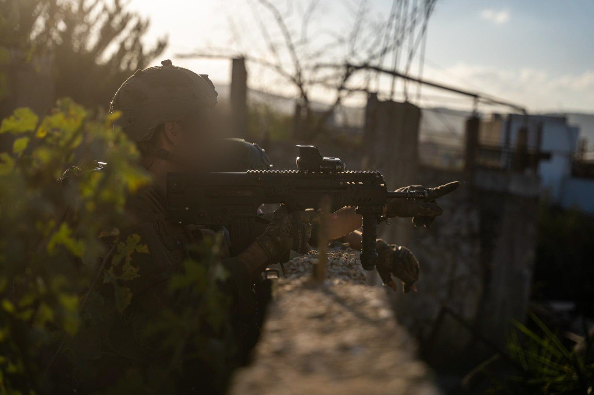

## Message 12831

דובר צה"ל:

כוחות צה"ל ממשיכים בפעילות הקרקעית ברצועת עזה ובדרום לבנון: חוסלה מהאוויר חוליית מחבלי חיזבאללה זמן קצר לאחר ששיגרה רקטות לצפון הארץ, לוחמי אוגדה 162 חיסלו עשרות מחבלים ברצועת עזה

ברצועת עזה, כוחות אוגדה 162 השמידו במרחב ג'באליה תשתיות טרור ופירי מנהרות וחיסלו עשרות מחבלים ביממה האחרונה. 
במהלך פעילות הכוחות, לוחמי צק"ח 401 חיסלו בירי טנקים, בהיתקלויות ובהכוונת תקיפות של חיל האוויר מספר מחבלים שהיוו איום על הכוחות.

כוחות אוגדת עזה חיסלו ברפיח מספר מחבלים שהיוו עליהם איום. כוחות אוגדה 252 השמידו תשתיות טרור ומחסן אמצעי לחימה במרכז רצועת עזה. חטיבת האש 454 הכווינה כלי טיס של חיל האוויר שחיסל מחבל הנדסה של ארגון הטרור חמאס לצד מספר מחבלים נוספים שהיוו עליהם איום.

בדרום לבנון, כוחות צה"ל מאוגדות 36, 98, 146 ו-91 איתרו במהלך פעילותם והשמידו מצבורים רבים של אמצעי לחימה ששימשו את ארגון הטרור חיזבאללה, בהם נשקים, טילי נ״ט ומשגרים שכוונו לעבר יישובי צפון הארץ, משגרי RPG, מחסניות, מטענים, רימונים וציוד לחימה נוסף.

