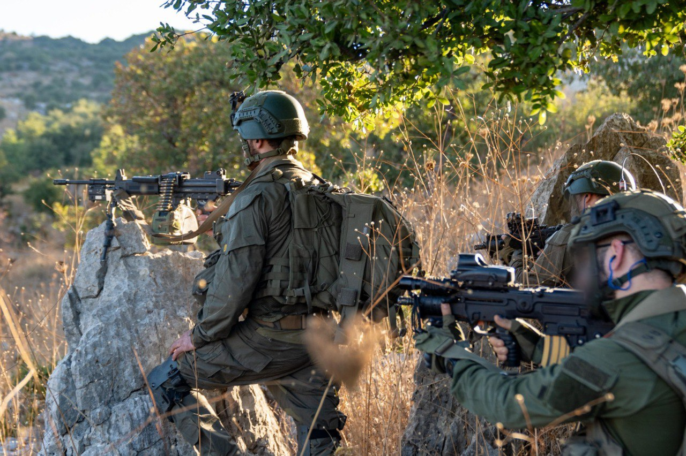

## Message 12865

דובר צה"ל:

חוסלו שבעה מפקדי חטיבות של ארגון הטרור חיזבאללה: כוחות צה״ל ממשיכים בפעולות ממוקדות בדרום לבנון

כוחות צה"ל ממשיכים בפעולות ממוקדות בגזרת לבנון, ובשיתוף פעולה הדוק בין כוחות אוויר מודיעין ואש, חוסלו עד כה 7 מפקדי חטיבות, 21 מפקדי גדודים ו-24 מפקדי פלוגות בארגון הטרור חיזבאללה.

בנוסף, צה״ל תקף למעלה מ- 3,200 מטרות טרור, מתוכן מאות מחסני אמצעי לחימה, מאות משגרים, עמדות נ״ט, תשתיות טרור ומפקדות, מתוכן כ-300 מטרות טרור נתקפו רק ביממה האחרונה. 

מצורפת גרפיקה עם פירוט חיסולי מפקדי השטח של ארגון הטרור חיזבאללה: https://bit.ly/4fcaciP

