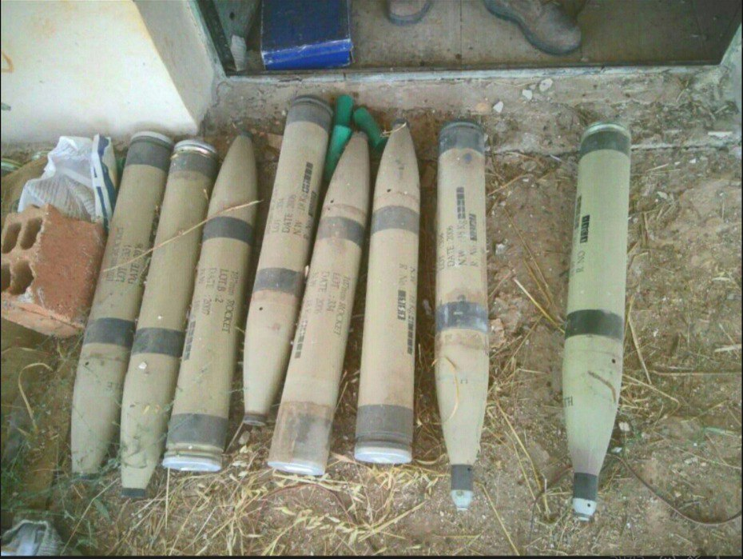

## Message 12889

דובר צה"ל:

צה"ל תקף ביממה האחרונה יותר מ-230 מטרות טרור בשטח לבנון וברצועת עזה, בהן שלוש מפקדות של היחידה האווירית של ארגון הטרור חיזבאללה (יחידה 127) בעומק לבנון; חוסלו כ-15 מחבלים בתקיפת חמ״ל של חיזבאללה בדרום לבנון

חיל האוויר תקף במהלך היממה האחרונה יותר מ-230 מטרות טרור של ארגוני הטרור חיזבאללה וחמאס ברחבי לבנון ורצועת עזה. בין המטרות הותקפו שלוש מפקדות של היחידה האווירית של ארגון הטרור חיזבאללה (יחידה 127), אשר אמונה, בין היתר, על שיגורי כטב״מים לעבר מדינת ישראל.

בימים האחרונים אוגדה 91 ממשיכה את פעילותה ההתקפית והממוקדת במרחב דרום לבנון נגד ארגון הטרור חיזבאללה, במקביל למשימות ההגנה על יישובי הגליל.

כוחות אוגדות 36 ו-146 הפועלים בדרום לבנון חיסלו ביממה האחרונה מחבלים, מהקרקע ומהאוויר, תקפו עשרות מטרות טרור והשמידו אמצעי לחימה רבים. 

כוחות אוגדה 98 זיהו חמ"ל של ארגון הטרור חיזבאללה בו פעלו מחבלים שהיוו איום על הכוחות. באמצעות מודיעין שנאסף באוגדה, מטוסי קרב של חיל האוויר תקפו את החמ"ל, סיכלו את האיום וחיסלו את המחבלים שפעלו בו. בתקיפה חוסלו כ-15 מחבלי חיזבאללה.

