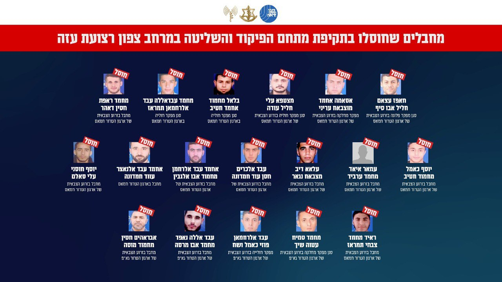

## Message 12909

דובר צה"ל ודוברות שב"כ:

בנקודת ריכוז מחבלים בצפון רצועת עזה: צה"ל ושב"כ חיסלו לפחות 18 מחבלים מארגוני הטרור חמאס וגא"פ

כלי טיס של חיל האוויר תקף בשבוע האחרון (ה'), באופן ממוקד ומדויק ובהכוונה מודיעינית של אמ״ן, שב״כ ופיקוד הדרום, נקודות ריכוז של מחבלים רבים מארגוני הטרור חמאס וגא״פ שפעלו במתחם פיקוד ושליטה שהוקם ברחבה ששימשה בעבר כרחבת בית הספר ״אבו חסן״ בצפון רצועת עזה. בתקיפה חוסלו לפחות 18 מחבלים מארגוני הטרור חמאס וגא"פ שפעלו במרחב.

מתחם הפיקוד והשליטה שהותקף שימש את המחבלים לתכנון והוצאה לפועל של פעולות טרור נגד כוחות צה״ל ואזרחי מדינת ישראל. 
מחבלים אלו היו מעורבים במתווי ירי תלול-מסלול לשטח הארץ, ופעלו להוצאת מתווי טרור נגד כוחות צה״ל ומדינת ישראל במהלך התקופה האחרונה והימים האחרונים בפרט.

טרם התקיפה ננקטו צעדים רבים בכדי לצמצם את הפגיעה בבלתי מעורבים, לרבות שימוש בחימוש מדויק, חוזי מהאוויר ומידע מודיעיני נוסף.

