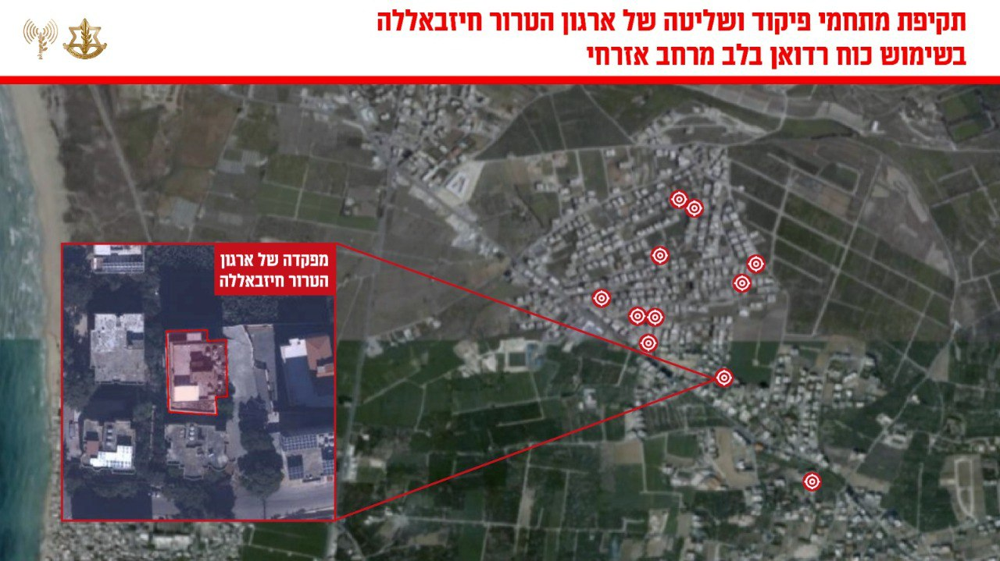

## Message 12918

דובר צה"ל:

צה"ל תקף מתחמי פיקוד ושליטה של ארגון הטרור חיזבאללה בהם מפקדות של 'כוח רדואן' במרחב אלחוש בדרום לבנון

מטוסי קרב של חיל האוויר, בהכוונת פיקוד הצפון תקפו במהלך היום במרחב אלחוש שבדרום לבנון כעשרה מתחמי פיקוד ושליטה של יחידות צבאיות שונות של ארגון הטרור חיזבאללה בהן מפקדות של ׳כוח רדואן׳. 
ממתחמים אלו קידם ארגון הטרור חיזבאללה פעילות טרור נגד אזרחי ישראל וכוחות צה״ל.

מזה זמן רב שארגון הטרור חיזבאללה משתלט באופן שיטתי על מרחבים אזרחיים ודתיים ברחבי מדינת לבנון כדי לבצע ולהוציא לפועל פעילויות ומתווי טרור, פעילות זו פוגעת ומסכנת את אזרחי מדינת לבנון.

טרם התקיפות ננקטו צעדים רבים על מנת לצמצם את הסיכוי לפגיעה באזרחים, הכוללים חימוש מדויק, תצפיות מהאוויר ואזהרות רבות בפלטפורמות השונות לאוכלוסייה באזור. 

תקיפות אלה מהוות חלק נוסף מהמאמץ המתמשך של צה״ל לפגוע בפעילות הטרור של חיזבאללה ולהקשות עליו לשקם את יכולותיו הצבאיות.

