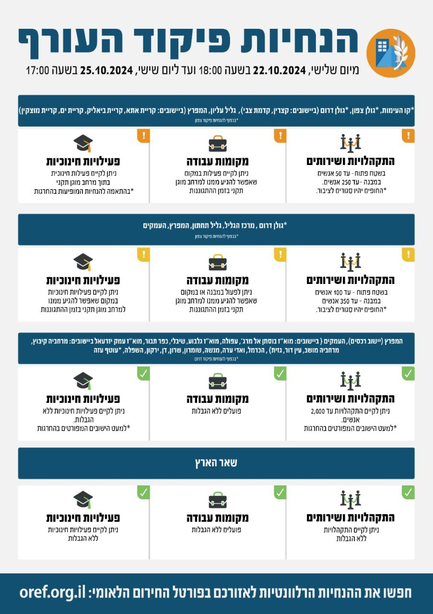

## Message 12924

שינויים במדיניות ההתגוננות של פיקוד העורף

בתום הערכת מצב, הוחלט כי היום (ג׳) בשעה 18:00, יתעדכנו הנחיות ההתגוננות של פיקוד העורף. במסגרת השינויים היישוב רכסים באזור המפרץ יעבור ממדרג פעילות חלקית למדרג פעילות מלאה עם הגבלת התקהלויות ושירותים של עד 2,000 אנשים. 
שאר אזורי הארץ נותרו ללא שינוי בהנחיות שניתנו עד כה.

יש להמשיך ולעקוב אחר ההנחיות המפורסמות על ידי פיקוד העורף באמצעי ההפצה הרשמיים.
ההנחיות המלאות מעודכנות בפורטל החירום הלאומי וביישומון פיקוד העורף.

