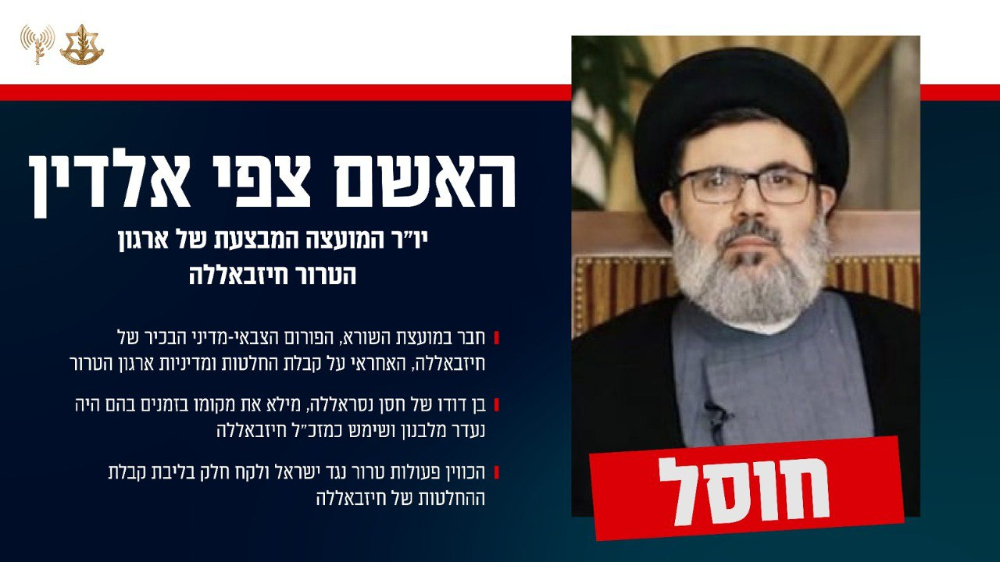

## Message 12937

דובר צה"ל:

צה"ל חיסל את ראש המועצה המבצעת של ארגון הטרור חיזבאללה, האשם צפי אלדין

כעת ניתן לאשר שבתקיפה לפני כשלושה שבועות חוסלו בדאחייה שבביירות האשם צפי אלדין, ראש המועצה המבצעת של ארגון הטרור חיזבאללה וחסין עלי הזימה, ראש מטה המודיעין של חיזבאללה, לצד מפקדים נוספים בחיזבאללה. 

מטוסי קרב של חיל האוויר תקפו, בהכוונה מודיענית מדויקת של אגף המודיעין, את המפקדה הראשית של מטה המודיעין של ארגון הטרור חיזבאללה, הנמצאת בתת קרקע, בלב אוכלוסייה אזרחית במרחב הדאחייה שבביירות. 

במפקדה שהו יותר מ-25 מחבלים שהשתייכו למטה המודיעין של הארגון וביניהם בלאל צאא׳ב עיאש, אחראי האיסוף האווירי במטה המודיעין ומחמוד מחמד שאהין, אחראי מטה המודיעין של חיזבאללה בסוריה.

האשם צפי אלדין חבר במועצת השורא, הפורום הצבאי-מדיני הבכיר ביותר של חיזבאללה, האחראי על קבלת החלטות ומדיניות ארגון הטרור.

