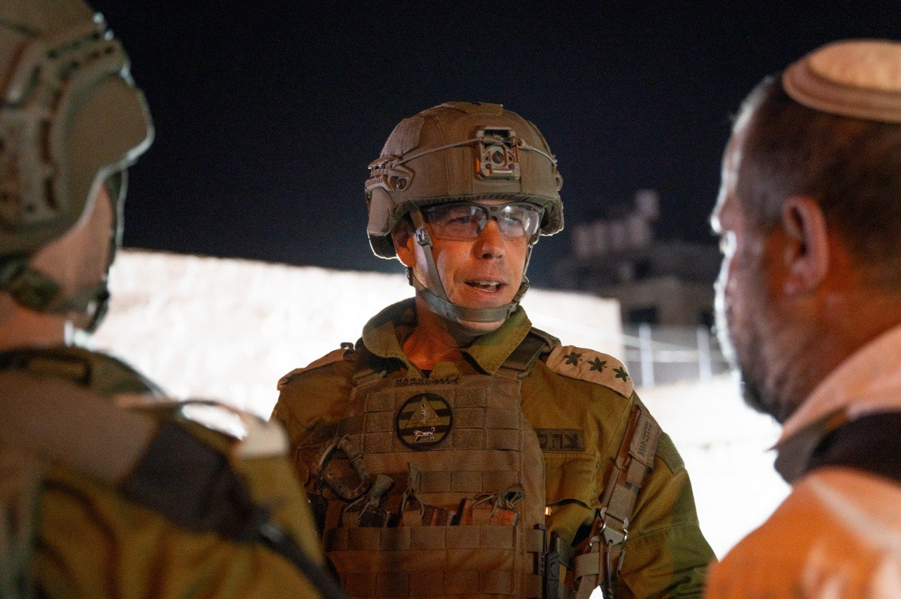

## Message 12956

דובר צה"ל:

כוחות הביטחון ממשיכים לפעול למעצר מבוקשים והחרמת אמצעי לחימה ברחבי פיקוד המרכז; אלפי מתפללים נכנסו תחת אבטחה למתחמי תפילה מרכזיים ברחבי הפיקוד

ביומיים האחרונים כוחות צה"ל, שב"כ ומג"ב פעלו במרחב יהודה ושומרון ובחטיבת הבקעה והעמקים, עצרו מספר מבוקשים והחרימו נשקים מסוגים שונים ואמצעי לחימה נוספים. 

במהלך פעילות הכוחות בחטיבת בנימין, הלוחמים החרימו נשקים ומחסניות.
במרחב חטיבת יהודה, כוח משטרה תחקר חשודים והחרים שני נשקים.
בחטיבת שומרון הכוחות עצרו שני מבוקשים בראס אל עין, ובפעילות יזומה לאור יום של יחידת דובדבן בקסבה בשכם, עצרו הלוחמים מבוקש החשוד בפעילות טרור. 
  
במרחב חטיבת עציון הכוחות תחקרו חשודים וביצעו סריקות במרחב, במהלכן איתרו והחרימו חלקי נשק ובחטיבת הבקעה והעמקים עצרו הלוחמים מספר מבוקשים נוספים .

