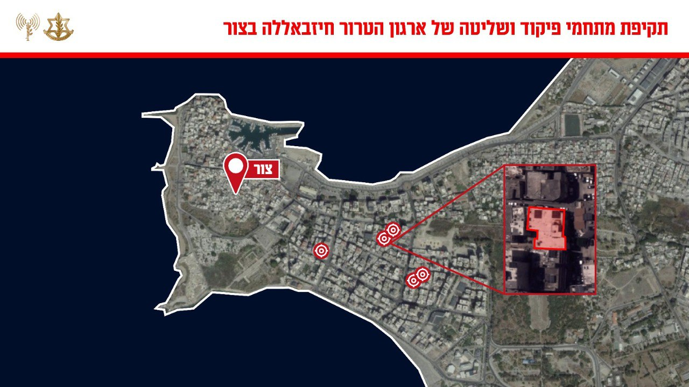

## Message 12971

דובר צה"ל:

צה״ל תקף מתחמי פיקוד ושליטה של ארגון הטרור חיזבאללה בהם מפקדות של יחידת ״חזית הדרום״ במרחב צור שבדרום לבנון

מטוסי קרב של חיל האוויר, בהכוונת פיקוד הצפון תקפו מוקדם יותר היום, במרחב צור שבדרום לבנון, מתחמי פיקוד ושליטה של יחידות צבאיות שונות של ארגון הטרור חיזבאללה בהן מפקדות של יחידת ״חזית הדרום״. 
ארגון הטרור חיזבאללה קידם ממתחמים אלו פעילויות טרור נגד אזרחי מדינת ישראל וכוחות צה״ל.

מרחב העיר צור מהווה מרכז כובד משמעותי של ארגון הטרור חיזבאללה ויחידת ״חזית הדרום״ שממנו הם מקדמים פעילויות טרור נגד מדינת ישראל וכוחות צה״ל.

ארגון הטרור חיזבאללה משתלט באופן שיטתי על מרחבים אזרחיים ברחבי מדינת לבנון, על מנת לבצע פעולות ומתווי טרור, תוך הטמעות פעיליו ומפקדיו במרחב האזרחי. פעילות זו פוגעת ומסכנת את אזרחי מדינת לבנון.

טרם התקיפה ננקטו צעדים רבים על מנת לצמצם את הסיכוי לפגיעה באזרחים, הכוללת אזהרות רבות בפלטפורמות שונות לאוכלוסייה באזור.

תקיפות אלו מהוות חלק נוסף במאמץ המתמשך של צה״ל לפגוע בפעילות הצבאית של ארגון הטרור חיזבאללה ולהקשות על הארגון לשקם את יכולותיו הצבאיות.

