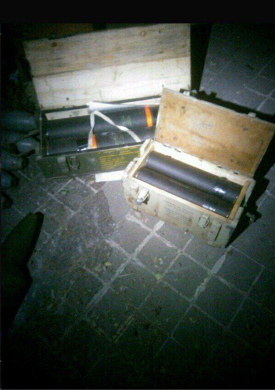

## Message 12981

דובר צה"ל:

עשרות מחבלים מחוסלים מהקרקע ומהאוויר בלבנון: בג'באליה שברצועת עזה נעצרו עד כה יותר מ-200 מחבלים    

פיקוד הצפון והאוגדות המתמרנות ממשיכים לפעול באופן ממוקד ומשמעותי בדרום לבנון נגד ארגון הטרור חיזבאללה. במהלך היממה האחרונה הכוחות חיסלו עשרות מחבלים ובמקביל, מטוסי קרב של חיל האוויר תקפו יותר מ-160 מטרות של ארגון הטרור חיזבאללה, חלקן בהכוונת פיקוד הצפון, בין המטרות שהותקפו: משגרים, מבנים צבאיים ותשתיות צבאיות ברחבי לבנון.

כוחות אוגדה 146 איתרו מרחבי שהייה של מחבלי חיזבאללה ובנוסף איתרו בתוך בית בדרום לבנון עשרות נשקים מסוג 'קלאצ'ניקוב' וטילי כתף. 

כוחות אוגדה 91 חיסלו ביממה האחרונה כ-20 מחבלים ואיתרו אמצעי לחימה רבים בהם: משגרי רקטות, מרגמות, נשקים, תחמושת ועוד.

כוחות אוגדה 98 איתרו מחסני אמצעי לחימה שהכילו מאות טילי נ"ט ופצצות מרגמה. כלי טיס של חיל האוויר, בהכוונת מרכז האש של האוגדה חיסל מספר חוליות של מחבלים בתקיפות מהאוויר.
כוחות אוגדה 36 איתרו והשמידו מספר מחסני אמצעי לחימה, משגר טילים, מטענים ועוד.

