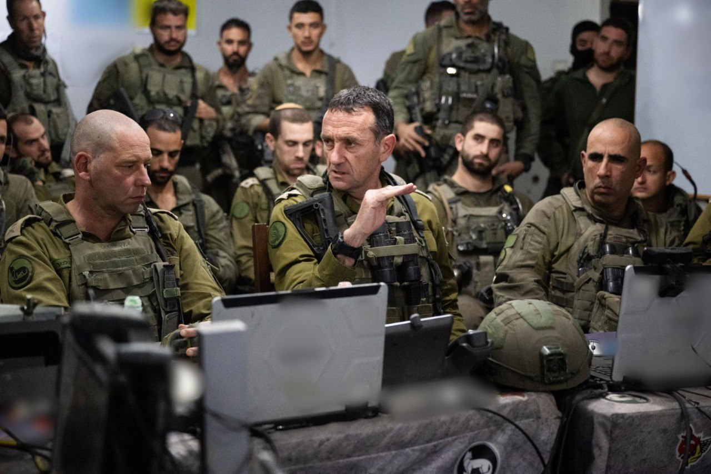

## Message 13005

דובר צה״ל: 

הרמטכ״ל בעזה: ״בצפון אפשר להגיע לסוף חד, גמרנו את שרשרת הפיקוד הבכירה של חיזבאללה״

למפקדי אוגדה 162: ״החיסול של סינוואר לא היה מקרי - זה מקצוע״

הרמטכ״ל, רב-אלוף הרצי הלוי, סייר אתמול (ד׳) במרחב ג׳באלייה ברצועת עזה וקיים הערכת מצב עם מפקד פיקוד הדרום, אלוף ירון פינקלמן, מפקד אוגדה 162, תת-אלוף איציק כהן, מפקדי החטיבות ומפקדים נוספים.

