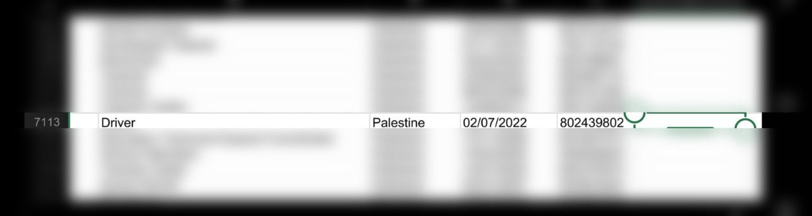

## Message 13011

הודעה משותפת לדובר צה"ל ודוברות שב"כ:

שנה לאחר הטבח: צה״ל ושב״כ חיסלו מפקד נח'בה שפיקד על הטבח במיגונית רעים ובמקביל שימש כעובד אונר"א

בפעילות משותפת של צה״ל ושב״כ, כלי טיס של חיל האוויר, בשיתוף מרכז האש של אוגדת עזה, תקף אתמול (ד') וחיסל את המחבל מחמד אבו עטיוי, מפקד נח׳בה בגדוד בריג' בחטיבת מחנות המרכז של ארגון הטרור חמאס. המחבל שימש כעובד בסוכנות אונר״א החל מיולי 2022. 

אבו עטיוי היה מעורב ברצח ובחטיפה של אזרחים ישראלים ופיקד על הרצח במיגונית בכביש 232 באזור רעים בטבח הרצחני של ארגון הטרור חמאס ב-7 באוקטובר. במהלך המלחמה, אבו עטיוי הכווין והוציא לפועל מספר מתווי טרור נגד כוחות צה"ל שפעלו ברצועה.

בעקבות האירוע נציגי מתאם פעולות הממשלה בשטחים דרשו מבכירים בקהילה הבינלאומית והאו״ם הבהרות וביצוע בירור דחוף בנושא השתתפות עובדי אונר״א בטבח השבעה באוקטובר ובפעילות טרור נגד ישראל.

