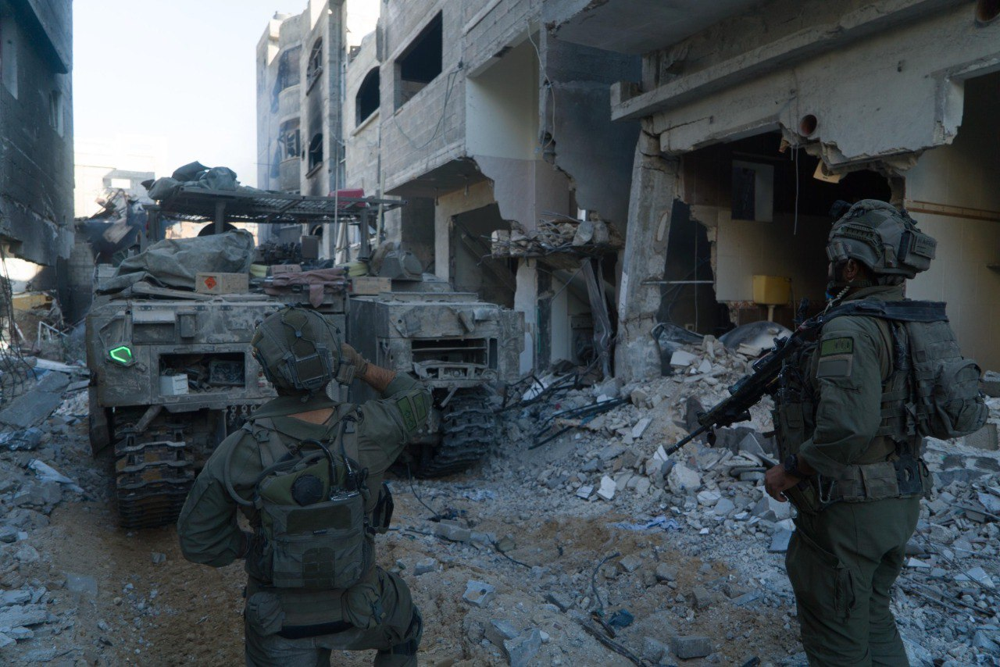

## Message 13028

דובר צה"ל:

חוסל מפקד מרחב עיתרון ביחידת רדואן של חיזבאללה: ביממה האחרונה חוסלו עשרות מחבלים בלבנון וברצועת עזה

חטיבת האש של אוגדה 91 הכווינה כלי טיס של חיל האוויר, שתקף וחיסל את המחבל עבאס עדנאן מסלם, מפקד מרחב עיתרון ביחידת רדואן של ארגון הטרור חיזבאללה. 
מסלם היה אחראי על הוצאה לפועל של מתווי ירי רבים נגד כוחות צה"ל ולעבר יישובים בצפון הארץ. במהלך היממה האחרונה כוחות צק"ח אלכסנדרוני חיסלו מספר מחבלים והשמידו תשתיות טרור ומבנים צבאיים של חיזבאללה.

ביממה האחרונה, מטוסי קרב של חיל האוויר תקפו כ-200 מטרות טרור בלבנון.
כוחות אוגדה 146 תקפו בדרום לבנון יותר מ-50 תשתיות טרור, עמדת נ"ט ומבנים צבאיים. 
בנוסף, כוח מאוגדה 98 זיהה מארב של חוליית מחבלים, ביצע ירי לעברם וחיסל אותם. כמו כן, הכוחות איתרו משגר של טילי קורנט טעון והשמידו אותו.

