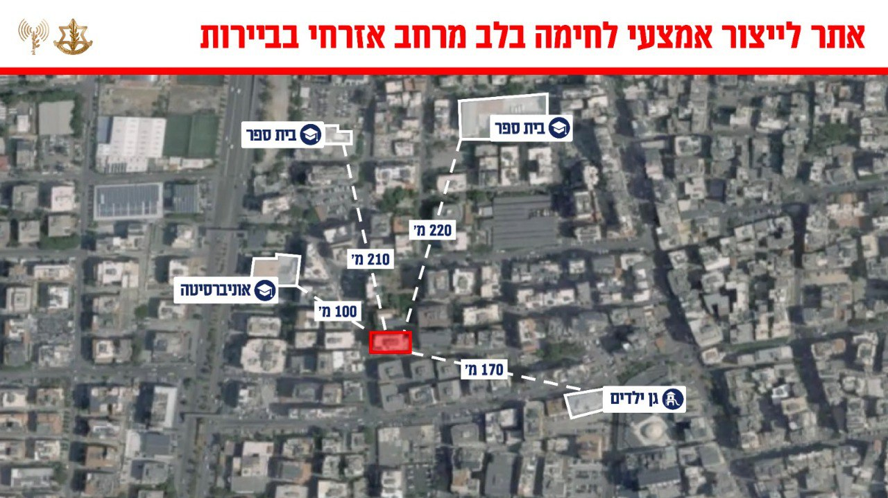

## Message 13071

דובר צה"ל:

צה״ל חיסל חוליית מחבלים ממערך ההגנה האווירית של חיזבאללה, במקביל, תקף בביירות אתר לייצור אמצעי לחימה ומפקדות של חיזבאללה

אתמול (ו'), בסגירת מעגל מהירה, כלי טיס של חיל האוויר תקף וחיסל חוליית מחבלים ממערך ההגנה האווירית של חיזבאללה ששיגרה טיל לעבר כלי טיס מאויש מרחוק של חיל האוויר במרחב כפר פילא בצפון הליטאני.
הכלי לא נפגע מהירי.

במהלך הלילה, מטוסי קרב של חיל האוויר, בהכוונה מודיעינית מדויקת של אגף המודיעין, תקפו אתרים לייצור אמצעי לחימה, מפקדה של מטה המודיעין ואמצעי איסוף של ארגון הטרור חיזבאללה בדאחייה שבביירות.

כלל המטרות ממוקמות בבניינים אזרחיים בלב אוכלוסייה אזרחית, זו היא דוגמה נוספת לניצול הציני של חיזבאללה באזרחי לבנון כמגן אנושי.

טרם התקיפה ננקטו צעדים רבים על מנת לצמצם את הסיכוי לפגיעה באזרחים, הכוללים אזהרות מקדימות לאוכלוסייה באזור.

