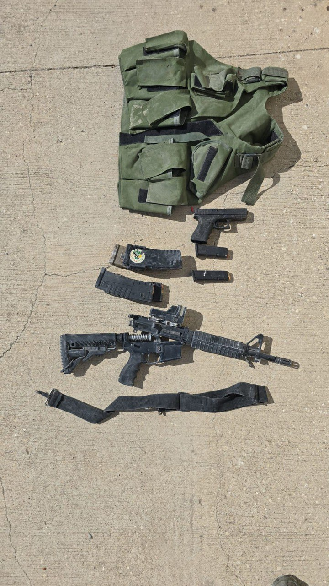

## Message 13077

הודעה משותפת לדובר צה״ל, דוברות המשטרה ודוברות שב"כ:

בתום כשבע שעות של "סיר לחץ", לוחמי הימ"מ, צה"ל ושב"כ חיסלו בטול כרם מחבל מארגון הטרור חמאס שתכנן לבצע פיגועים בטווח הזמן המיידי

כוחות ימ״מ, סיירת חרוב ושב״כ פעלו משעות הבוקר המוקדמות, על בסיס מודיעין של שב״כ, בטול כרם שבחטיבת מנשה לחיסול אסלאם עודה, פעיל בתשתית החמאס בגזרה שתכנן פיגועים וחימש מחבלים למטרת ביצוע פיגועים. 

במהלך הפעילות, המחבל פתח באש לעבר הלוחמים שהחלו בנוהל "סיר לחץ" וירו לעברו. בתום חילופי האש המחבל אסלאם עודה חוסל.
ברכבו נמצאו אמצעי לחימה בהם חומרים להרכבת מטענים.

עודה, יחד עם זאהי עופי, שחוסל בתקיפה אווירית בטול כרם ב-3 באוקטובר ומחבלים נוספים, היה אחראי על תכנון פיגועים משמעותיים, שהיו עתידים לצאת לפועל ביום השנה הראשון לציון ה-7 באוקטובר. 
לאחר חיסולו של עופי, עודה פיקד והוביל את התשתית ועסק בימים האחרונים בתכנון פיגועים נוספים.

כוחות הביטחון ימשיכו על מנת לסכל פיגועים, מחבלים ותשתיות טרור לשמירה על ביטחון מדינת ישראל.

