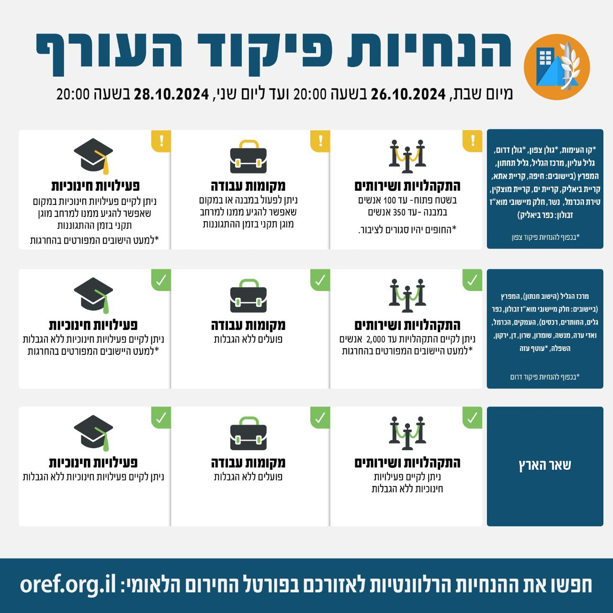

## Message 13088

דובר צה"ל:

שינויים במדיניות ההתגוננות של פיקוד העורף

בתום הערכת מצב, הוחלט כי הערב (ש') בשעה 20:00, יתעדכנו הנחיות ההתגוננות של פיקוד העורף. במסגרת השינויים אזורי ההתרעה קו העימות, גולן צפון, גולן דרום (ביישובים קצרין וקדמת צבי), גליל עליון וחלק מיישובי אזור המפרץ (קריית אתא, קריית ביאליק, קריית ים וקריית מוצקין) יעברו ממדרג פעילות מצומצמת למדרג פעילות חלקית. בנוסף, אזור התרעה עמקים, אזור התרעה המפרץ (ביישובים החותרים, כפר גלים וחלק מיישובי מוא"ז זבולון) והיישוב חנתון באזור התרעה מרכז הגליל, יעברו ממדרג פעילות חלקית למדרג פעילות מלאה עם הגבלת התקהלויות ושירותים של עד 2,000 אנשים. 
שאר אזורי הארץ נותרו ללא שינוי בהנחיות שניתנו עד כה.

יש להמשיך ולעקוב אחר ההנחיות המפורסמות על ידי פיקוד העורף באמצעי ההפצה הרשמיים.
ההנחיות המלאות מעודכנות בפורטל החירום הלאומי וביישומון פיקוד העורף.

