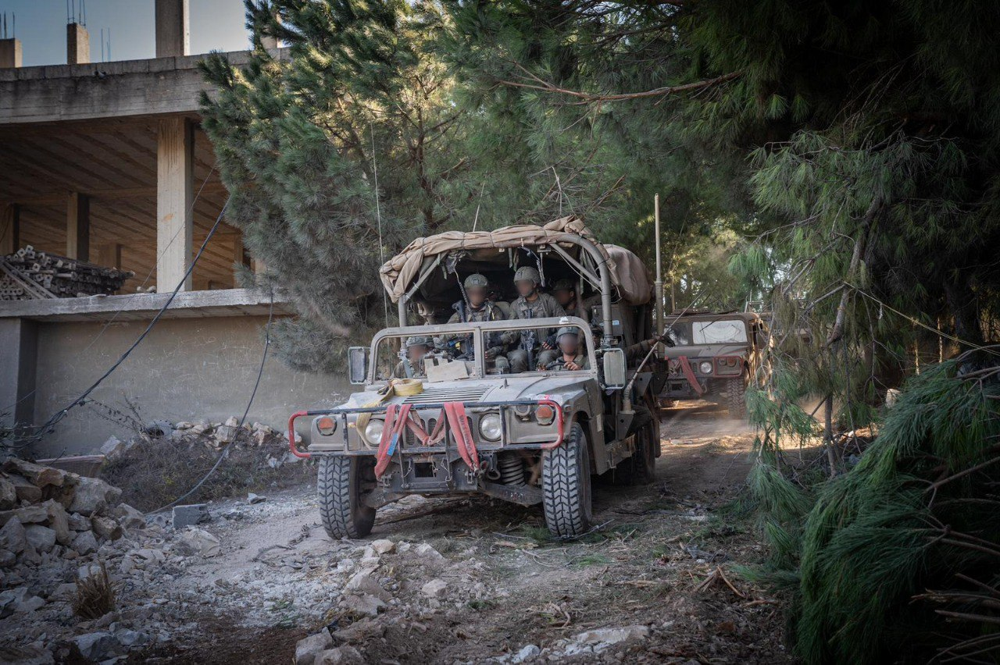

## Message 13100

דובר צה״ל:

במהלך הלילה צה״ל תקף תשתיות טרור לייצור ואחזקה של אמצעי לחימה בדאחיה בבירות; ביממה האחרונה הושמדו עשרות מטרות טרור בלבנון וברצועת עזה

במהלך הלילה מטוסי קרב של חיל האוויר בהכוונה מודיעינית מדוייקת של אגף המודיעין, תקפו בדאחיה שבבירות אתרים לייצור ולתחזוקת אמצעי לחימה ומחסן אמצעי לחימה של ארגון הטרור חיזבאללה.

במהלך היממה האחרונה מטוסי קרב של חיל האוויר בהכוונת פיקוד הצפון חיסלו כ-70 מחבלים ותקפו יותר מ-120 מטרות טרור של ארגון הטרור חיזבאללה.

מטוסי קרב של חיל האוויר תקפו תשתית צבאית בשימוש היחידה האווירית של חיזבאללה (127) וחוליית מחבלים של היחידה בדרום לבנון.

במהלך פעילות של כוחות אוגדה 146, בסגירת מעגל מהירה, כלי טיס של חיל האוויר תקף מבנה ממנו זוהו מחבלים יורים לעבר הכוח שפעל בשטח.

במקביל כוחות אוגדה 162 ממשיכים לפעול במרחב ג׳באליה שברצועת עזה וחיסלו ביממה האחרונה יותר מ-40 מחבלים. לוחמי גבעתי הפועלים במרחב השמידו תשתיות טרור ואיתרו ציוד צבאי רב.

