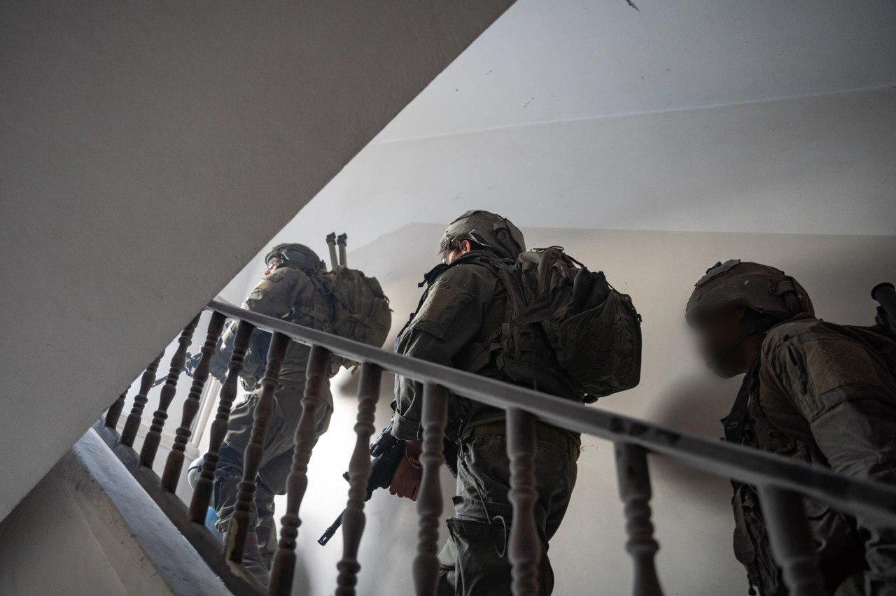

## Message 13134

דובר צה"ל:

כוחות צה"ל ממשיכים בפעילות בדרום לבנון וברצועת עזה: ביממה האחרונה חוסלו עשרות מחבלים ואותרו אמצעי לחימה רבים 

כוחות אוגדה 91 ממשיכים לתקוף תשתיות טרור ולהחרים אמצעי לחימה של ארגון הטרור חיזבאללה בדרום לבנון. במהלך היממה האחרונה, חטיבת האש של האוגדה זיהתה חוליית מחבלים בסמוך למבנה צבאי של חיזבאללה שהיוותה איום על כוחותינו, בסגירת מעגל מהירה ובשיתוף עם חיל האוויר החוליה חוסלה.

כוחות אוגדה 146 מאתרים ומשמידים תשתיות ומתקני שהייה בהם התבצרו מחבלים של ארגון הטרור חיזבאללה בדרום לבנון לצורך פגיעה בכוחותינו. מטוסי קרב של חיל האוויר, בהכוונת פיקוד הצפון, תקפו עשרות מטרות טרור, בהן משגר ממנו זוהו שיגורים לשטח הארץ וחיסלו עשרות מחבלים במהלך היממה האחרונה.

