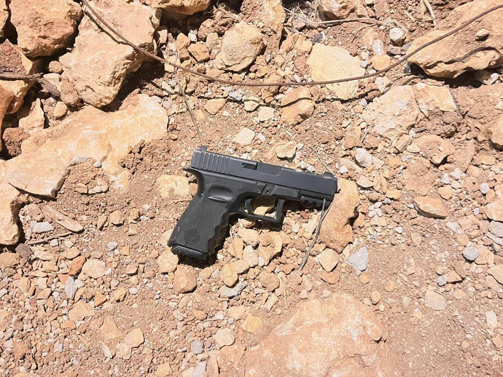

## Message 13144

כוחות צה"ל, שב"כ ומג"ב פעלו במהלך הלילה לסיכול פעילויות טרור ועצרו 11 מבוקשים במספר מרחבים ברחבי יהודה ושומרון. 

במהלך מבצע חטיבתי בסלפית שבחטיבת אפרים הכוחות תחקרו כ-20 חשודים בפעילות טרור והחרימו עשרות אלפי שקלים של כספי טרור. בנוסף, בחטיבת שומרון הכוחות עצרו שישה מבוקשים והחרימו רובה מסוג M-16, בבית אומר שבחטיבת עציון הכוחות עצרו מבוקש והחרימו רובה ואקדח.

