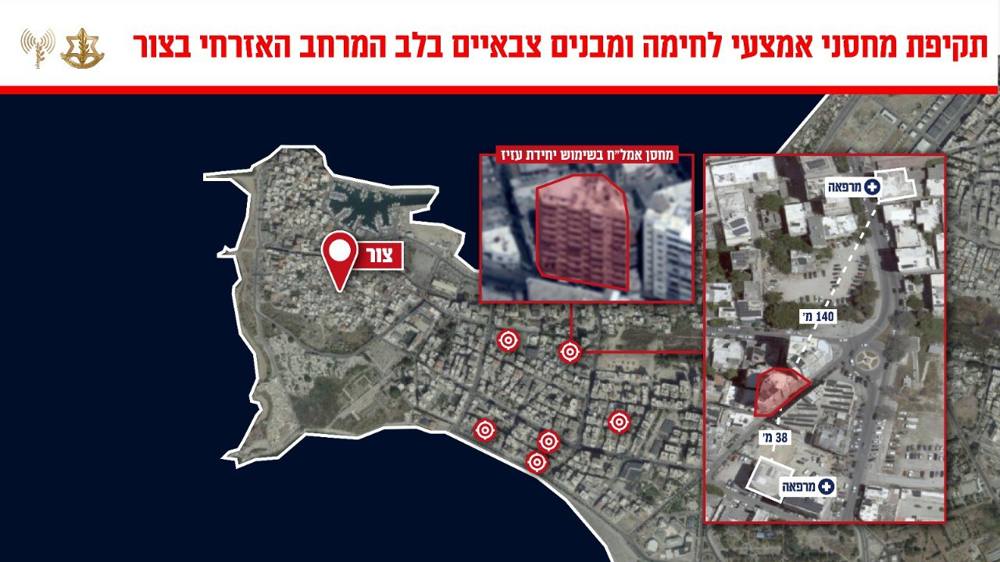

## Message 13152

דובר צה"ל:

בפעם השנייה בתוך מספר ימים: צה"ל תקף מטרות טרור של ארגון הטרור חיזבאללה במרחב צור שבדרום לבנון

מטוסי קרב של חיל האוויר בהכוונת פיקוד הצפון תקפו מוקדם יותר היום במרחב צור שבדרום לבנון, מחסני אמצעי לחימה וטילי נ"ט, מבנים צבאיים ועמדות תצפית של יחידות צבאיות שונות של ארגון הטרור חיזבאללה ביניהן "יחידת עזיז", האחראית על ירי ממרחב דרום מערב לבנון לעבר שטח מדינת ישראל. ארגון הטרור חיזבאללה קידם ממתחמים אלו פעילויות טרור נגד אזרחי מדינת ישראל וכוחות צה"ל. 

מרחב העיר צור מהווה מרחב טרור משמעותי של ארגון הטרור חיזבאללה ויחידת "עזיז" שממנו הם מקדמים פעילויות טרור נגד מדינת ישראל וכוחות צה"ל. 

ארגון הטרור חיזבאללה משתלט באופן שיטתי על מרחבים אזרחיים ברחבי מדינת לבנון, על מנת לבצע פעולות ומתווי טרור, תוך הטמעת פעיליו ומפקדיו במרחב האזרחי. פעילות זאת פוגעת ומסכנת את אזרחי מדינת לבנון.

