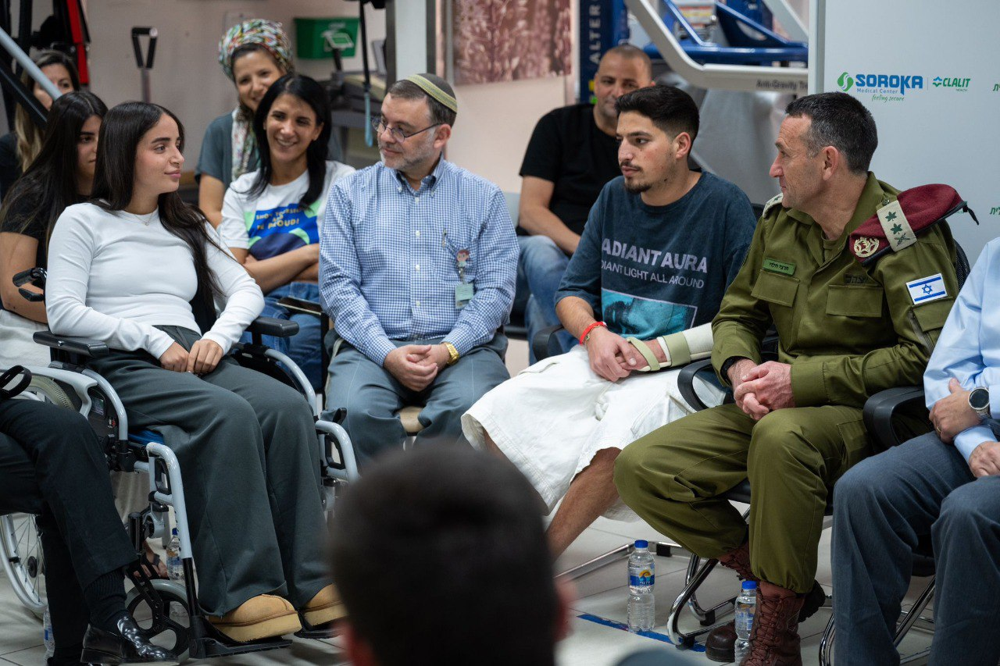

## Message 13155

דובר צה״ל: 

שבוע ההצדעה לפצועי מלחמת ״חרבות ברזל״

הרמטכ״ל במחלקת שיקום פצועים בסורוקה: ״כשהחברים שלכם נלחמים בשטח ויודעים שאתם פה מתקדמים - זה מחזק אותם״

במסגרת שבוע ההצדעה לפצועי צה"ל ממלחמת "חרבות ברזל", הרמטכ"ל, רב-אלוף הרצי הלוי ביקר היום (ב') במרכז הרפואי "סורוקה" בבאר שבע. 

במהלך הביקור שוחח הרמטכ"ל עם הפצועים ומשפחותיהם ועם הצוותים הרפואיים, והודה להם על תרומתם ופועלם במלחמה. 
בנוסף, הרמטכ״ל העניק תעודת הוקרה למנהל המרכז הרפואי ״סורוקה״, פרופ׳ שלומי קודש. 

מדברי הרמטכ״ל, רב-אלוף הרצי הלוי: ״הדרך של ההחלמה היא דרך לא פחות קשה מהלחימה בשדה הקרב. כשהחברים שלכם נלחמים בשטח ויודעים שאתם פה מתקדמים - זה מחזק אותם. השותפות והחיבור בין אנשי הרפואה, הטייסות והכוחות בשטח - הם הכוח שלנו. לצוותים הרפואיים, אני שומע מהפצועים ומהמשפחות את התחושות שלהם על תרומתכם יוצאת דופן. כל שרשרת הטיפול, מהחובש הראשון בשטח ועד הליווי בשיקום - אתם מצילים חיים״.

