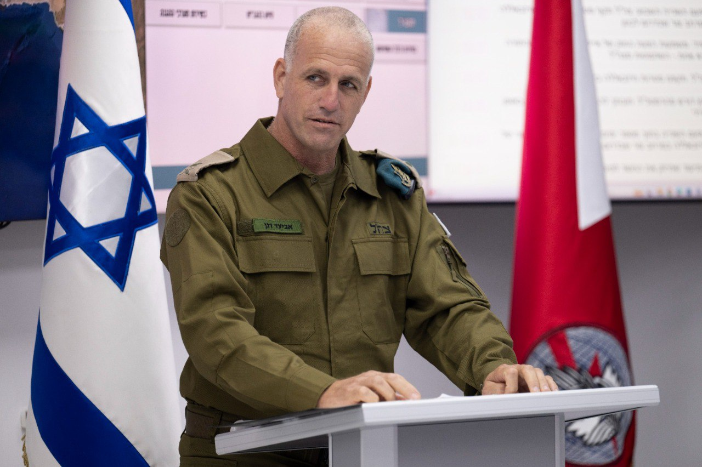

## Message 13176

דובר צה"ל: 

מפקד חדש לאגף התקשוב וההגנה בסייבר

אלוף אביעד דגן רייס נכנס לתפקיד ראש אגף התקשוב וההגנה בסייבר במקומו של אלוף ערן ניב, אשר שירת בתפקיד זה בשלוש השנים האחרונות, ומסיים בימים אלו 35 שנות שירות בצה״ל.

טקס חילופי המפקדים נערך הערב (ב') במחנה "רבין" (הקריה), בראשות ראש המטה הכללי, רב-אלוף הרצי הלוי, ובהשתתפות חברי פורום מטכ"ל ומשפחות.

להודעה המלאה:
https://IDFANC.activetrail.biz/ANC230620041212

