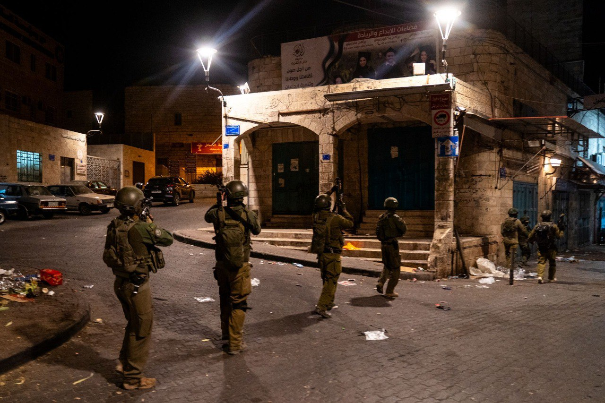

## Message 13199

דובר צה"ל:

כ-260 עצורים וכ-50 נשקים הוחרמו החודש: לוחמי צה"ל, שב"כ ומג"ב ממשיכים לפעול בעומק הכפרים והערים הפלסטיניות בפיקוד המרכז

כוחות צה"ל, שב"כ ומג"ב ממשיכים לפעול יומם ולילה לסיכול טרור ושמירה על תושבי הגזרה בפיקוד המרכז. במהלך החודש האחרון הכוחות עצרו כ-260 מבוקשים ברחבי יהודה ושומרון ובחטיבת הבקעה והעמקים והשמידו עשרות מטענים. בנוסף, הכוחות החרימו כ-50 נשקים, מאות אלפי שקלים בכספי טרור ועשרות רכבים לא חוקיים.

במהלך הלילה, הלוחמים פעלו לסיכול טרור ועצרו 14 מבוקשים ביהודה ושומרון ובחטיבת הבקעה והעמקים. הכוחות פעלו בחטיבת עציון למעצר תשעה מבוקשים ובחטיבות אפרים, שומרון, יהודה והבקעה והעמקים פעלו למעצר חמישה מבוקשים נוספים. 
אין נפגעים לכוחותינו.

