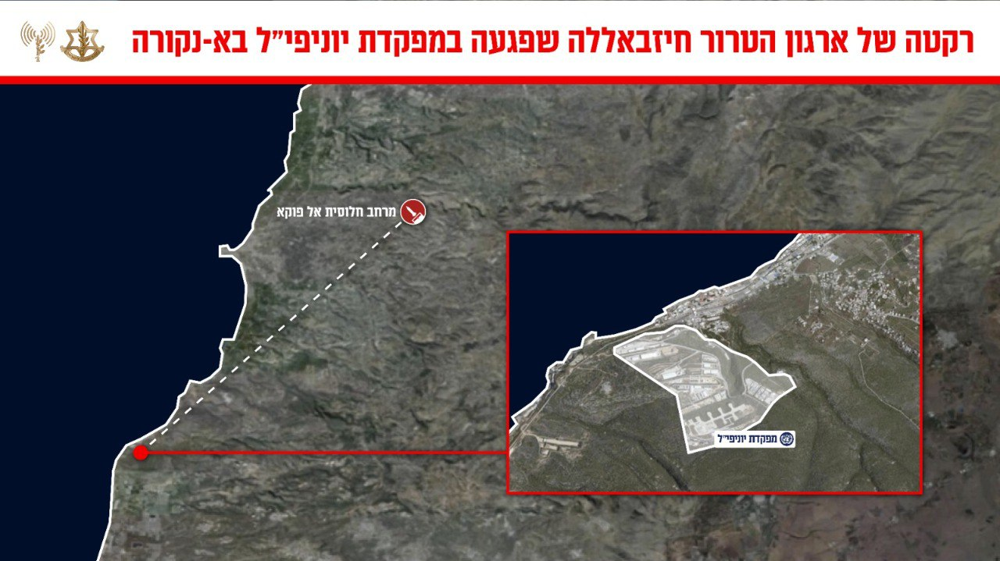

## Message 13208

דובר צה״ל:

מוקדם יותר היום (ג'), התקבל דיווח על פגיעה במפקדת יוניפי״ל במרחב א-נקורה בדרום לבנון. 
לאחר בדיקה עולה כי המפקדה נפגעה כתוצאה משיגור של ארגון הטרור חיזבאללה ששוגר ממרחב חלוסית אל-פוקא.

התקבל דיווח על ידי יוניפי״ל על מספר נפגעים כתוצאה מהפגיעה במפקדה.

ארגון הטרור חיזבאללה ממשיך להפר באופן שיטתי את הדין הבין לאומי, ומהווה איום על תושבי מדינת ישראל והכוחות בינלאומיים במרחב.

